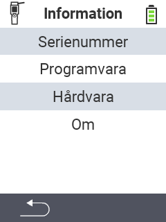

{}
Om du klickar på ett menyalternativ kommer du att omdirigeras till en beskrivning av respektive funktion.
{}

<map name="workmap">
  <area shape="rect" coords="2,40,238,80" alt="Serienummer" title="För att hämta serienumret på din enhet klicka här&#10;Mausklick: zur Dokumentation" href="/sv/docs/device/info/serial-number/">
  <area shape="rect" coords="2,80,238,120" alt="Programvara" title="Instruktionerna för att visa din programvaruversion finns här&#10;Mausklick: zur Dokumentation" href="/sv/docs/firmware/versions/">
  <area shape="rect" coords="2,120,238,160" alt="Hårdvara" title="För att komma åt hårdvaruinformationen på din enhet klicka här&#10;Mausklick: zur Dokumentation" href="/sv/docs/device/info/hardware/">
  <area shape="rect" coords="2,160,238,200" alt="Om" title="Visa leverantörsinformation&#10;Mausklick: zur Dokumentation" href="/sv/docs/device/info/about/">

  <area shape="rect" coords="2,282,120,319" alt="Tillbaka" title="Hoppa tillbaka en nivå&#10;Mouse click: open documentation" href="/sv/docs/device/">
</map>
