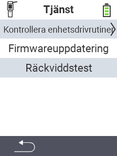

{}
Om du klickar på ett menyobjekt kommer du att omdirigeras till en beskrivning av respektive funktion.
{}

<map name="workmap">
  <area shape="rect" coords="2,42,238,82" alt="Kontrollera enhetsdrivrutiner" title="Instruktionerna för att kontrollera dina enhetsdrivrutiner finns här&#10;Mus klick: öppna dokumentation" href="/en/docs/diagnosis/hardware/">
  <area shape="rect" coords="2,82,238,122" alt="Firmware-uppdatering" title="Instruktionerna för att uppdatera din firmware finns här&#10;Mus klick: öppna dokumentation" href="/en/docs/firmware/update/">
  <area shape="rect" coords="2,122,238,162" alt="Räckviddstest" title="Instruktionerna för att utföra ett räckviddstest finns här&#10;Mus klick: öppna dokumentation" href="/en/docs/diagnosis/rfid-scan/">

  <area shape="rect" coords="2,282,120,319" alt="Tillbaka" title="Hoppa tillbaka på nivå&#10;Mus klick: öppna dokumentation" href="/en/docs/device/">
</map>
