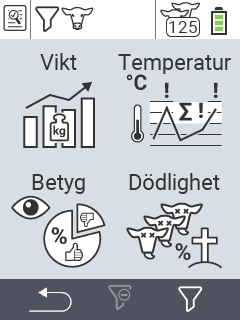

{}
Om du klickar på ett menyobjekt kommer du att omdirigeras till en beskrivning av respektive funktion.
{}

<map name="workmap">
  <area shape="rect" coords="3,40,116,160" alt="Vikt" title="Utvärdera dina sparade data i viktsektionen&#10;Musklick: öppna dokumentation" href="/sv/docs/evaluation/weight/">
  <area shape="rect" coords="3,160,116,279" alt="Betyg" title="Utvärdera dina sparade data i betygssektionen&#10;Musklick: öppna dokumentation" href="/sv/docs/evaluation/rating/">

  <area shape="rect" coords="116,40,238,160" alt="Temperatur" title="Utvärdera dina sparade data i temperatursektionen&#10;Musklick: öppna dokumentation" href="/sv/docs/evaluation/temperature/">
  <area shape="rect" coords="116,160,238,279" alt="Dödlighet" title="Utvärdera dina sparade data i dödlighetssektionen&#10;Musklick: öppna dokumentation" href="/sv/docs/evaluation/mortality/">

  <area shape="rect" coords="150,282,238,319" alt="Filter" title="Ställ in ett filter&#10;Musklick: till dokumentationen" href="/sv/docs/filter">
  <area shape="rect" coords="2,282,95,319" alt="Tillbaka" title="Hoppa tillbaka en nivå&#10;Musklick: till dokumentationen" href="/sv/docs/menu/mainmenu/">
</map>
