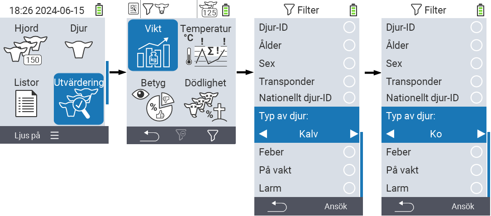
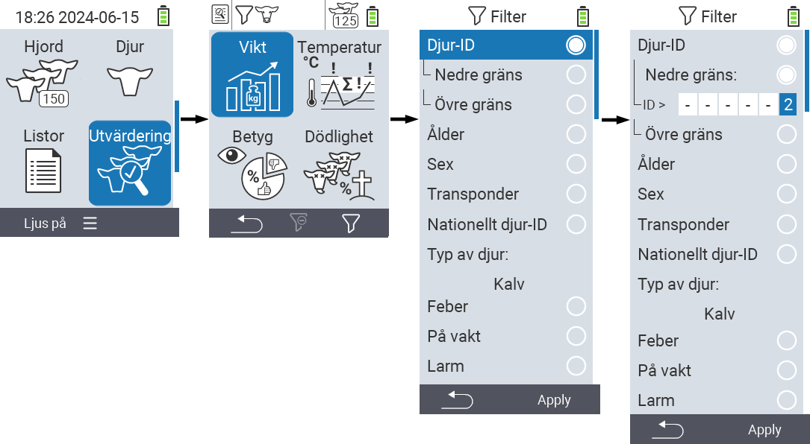
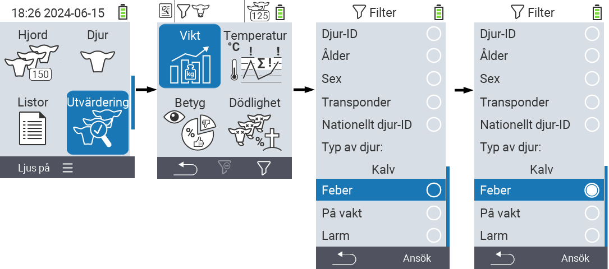

## Applicera filter {#applying-filters}

{}
Filtret hjälper dig att göra ett urval med hjälp av filterkriterier inom menyalternativen ``, `` och `` på VitalControl-enheten. Så snart du applicerar ett filter, visas symboler för de olika filterkriterierna högst upp på skärmen. Dessa symboler används för att hjälpa dig att ta reda på om och vilka filterkriterier som är aktiverade. Till exempel, om du ställer in filtret `` till han, kommer enheten endast att använda han-djur. Om du också aktiverar filtret ``, använder enheten endast han-djur som finns på observationslistan.
{}

För att skapa ett filter i utvärderingarna, gör följande:

1. I undermenyn som tillhör toppmenyalternativet  `` tryck på `F3`-tangenten  en gång. Inom undermenyn som tillhör toppmenyalternativen  `` och  ``, måste du trycka på tangenten två gånger.

2. En undermeny öppnas där du kan ställa in alla filteralternativ. Du kan filtrera efter ``, ``, ``, ``, ``, ``, ``, `` och ``.

3. För filtren ``, ``, `` och `` navigera till motsvarande område och bekräfta med ``. Använd piltangenterna ◁ ▷ för att ange önskad inställning. Använd `F3`-tangenten `` för att sätta den valda inställningen på plats. För att kassera dina filterändringar, tryck på `F1`-tangenten &nbsp;&nbsp;.

4. För filtren `` och `` välj motsvarande kriterium och bekräfta med ``. Du kommer nu att visas en nedre och övre gräns. Navigera till önskad gräns med piltangenterna △ ▽ och bekräfta genom att trycka på `` två gånger. Nu kan du ställa in önskat nummer med piltangenterna ◁ ▷ och piltangenterna △ ▽. När alla inställningar är korrekta trycker du på `` igen för att lämna inställningsläget och tillämpa det valda filtret/filtrerna med `F3`-tangenten ``. Med `F1`-tangenten &nbsp;&nbsp;, kan du ångra dina ändringar om så önskas.

5. För filtren ``, `` och `` finns det möjlighet att inaktivera eller aktivera deras tillämpning. För att göra detta, välj motsvarande filter och bekräfta med ``. Filtret är nu aktivt. Bekräfta igen med `` för att inaktivera filtret.

6. När du har ställt in alla filter, använd `F3`-tangenten `` för att sätta de definierade filtren på plats eller tryck på `F1`-tangenten  för att ångra dina ändringar av filtret/filtren.
