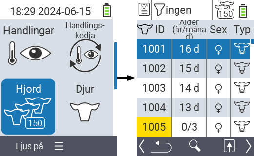
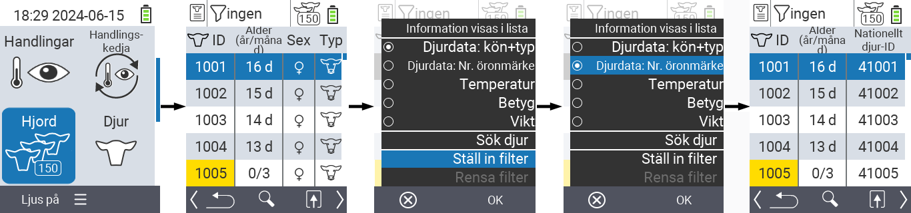
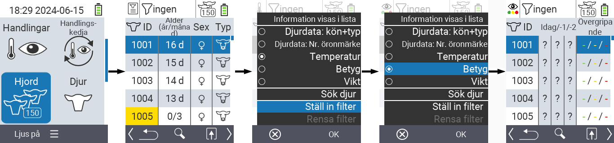
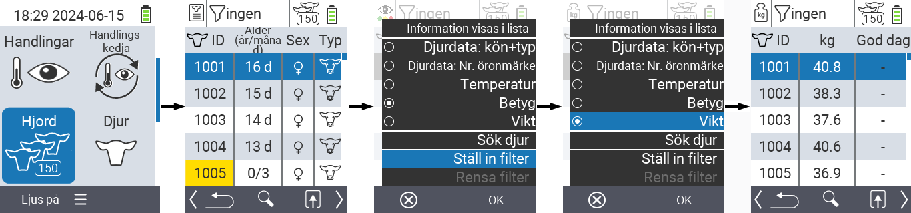
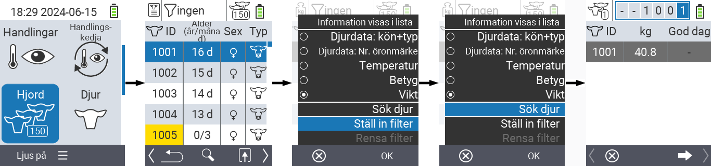
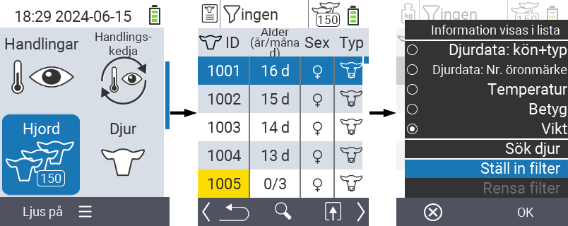
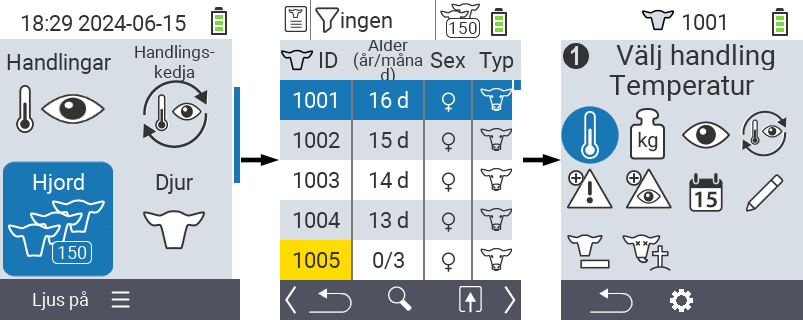

## Herd {#herd}

Inom menyalternativet Hjord kan du visa hela din hjord, söka efter enskilda djur och visa viktig information. Du har följande möjligheter:

- Visa [djurdata](#view-animal-data)
- Visa [temperaturdata](#display-temperature)
- Visa [betygsdata](#view-rating)
- Visa [viktdata](#view-rating)
- [Sök djur](#search-animal)
- Ställ in [filter](#set-filter)
- [Åtgärder](#call-action-menu)

### Förberedande steg {#preparatory-steps}

1. På huvudskärmen på din VitalControl-enhet, välj menyalternativet  `` och tryck på ``-knappen.

2. Din hjordöversikt öppnas.

    

### Visa djurdata {#view-animal-data}

1. Slutför de förberedande stegen.

2. Använd `F3`-tangenten &nbsp;&nbsp; för att öppna en popup-meny som listar informationskategorierna som kan visas för hjordlistan. Använd piltangenterna △ ▽ för att markera raden `` eller `` och välj denna kategori genom att trycka på den centrala ``-knappen eller `F3`-tangenten ``. De två valmöjligheterna skiljer sig åt i visningen av informationsfältet.

3. Djurdata kommer nu att visas som innehåll i hjordlistan.

4. Alternativt kan du använda piltangenterna ◁ ▷ för att växla mellan de olika visningsalternativen.

    

{}
Som standard visas djurdata först. Endast när du har vikten visad, till exempel, måste du ställa in visningen av djurdata igen.
{}

### Visa temperatur {#display-temperature}

1. Slutför förberedelsestegen.

2. Använd `F3`-tangenten &nbsp;&nbsp; för att öppna en popup-meny som listar informationskategorierna som kan visas för besättningslistan. Använd piltangenterna △ ▽ för att markera raden `` och välj denna kategori genom att trycka på den centrala ``-knappen eller `F3`-tangenten ``.

3. Temperaturdata kommer nu att visas som innehåll i besättningslistan.

4. Alternativt kan du använda piltangenterna ◁ ▷ för att växla mellan de olika visningsalternativen.

    

### Visa betyg {#view-rating}

1. Slutför förberedelsestegen.

2. Använd `F3`-tangenten &nbsp;&nbsp; för att öppna en popup-meny som listar informationskategorierna som kan visas för besättningslistan. Använd piltangenterna △ ▽ för att markera raden `` och välj denna kategori genom att trycka på den centrala ``-knappen eller `F3`-tangenten ``.

3. Betygsdata kommer nu att visas som innehåll i besättningslistan.

4. Alternativt kan du använda piltangenterna ◁ ▷ för att växla mellan de olika visningsalternativen.

    

### Visa vikt {#display-weight}

1. Slutför förberedelsestegen.

2. Använd `F3`-tangenten &nbsp;&nbsp; för att öppna en popup-meny som listar informationskategorierna som kan visas för besättningslistan. Använd piltangenterna △ ▽ för att markera raden `` och välj denna kategori genom att trycka på den centrala ``-knappen eller `F3`-tangenten ``.

3. Viktdata kommer nu att visas som innehåll i besättningslistan.

4. Alternativt kan du använda piltangenterna ◁ ▷ för att växla mellan de olika visningsalternativen.

### Sök djur {#search-animal}

1. Slutför förberedelsestegen.

2. Använd `F3`-tangenten &nbsp;&nbsp; för att öppna en popup-meny som listar olika alternativ. Använd piltangenterna △ ▽ för att markera funktionen `` och starta sökfunktionen genom att trycka på den centrala ``-tangenten eller `F3`-tangenten ``. Alternativt kan du använda `On/Off`-knappen  direkt efter steg ett.

3. Använd piltangenterna △ ▽ ◁ ▷ för att ange önskat djurnummer och bekräfta med ``.

    

### Ställ in filter {#set-filter}

1. Slutför förberedelsestegen.

2. Använd `F3`-tangenten &nbsp;&nbsp; för att öppna en popup-meny som listar olika alternativ. Använd piltangenterna △ ▽ för att markera funktionen `` och starta filterfunktionen genom att trycka på den centrala ``-tangenten eller `F3`-tangenten ``.

3. Hur man tillämpar filtret kan du hitta [här]().

    

### Öppna åtgärdsmeny {#call-action-menu}

Du har alltid möjlighet att öppna åtgärdsmenyn för ett djur.

1. Slutför förberedelsestegen.

2. Välj ett djur från listan med piltangenterna △ ▽ och bekräfta med ``.

3. Åtgärdsmenyn är nu öppen. Hur du använder den kan du hitta [här](../actions).

4. Återgå till djurlistan med `F3`-tangenten.

    
