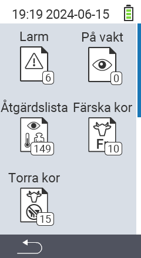

{}
Om du klickar på ett menyobjekt kommer du att omdirigeras till en beskrivning av respektive funktion.
{}

<map name="workmap">
  <area shape="rect" coords="3,40,116,160" alt="Larm lista" title="Kolla din larm lista&#10;Musklick: öppna dokumentation" href="/sv/docs/lists/alarm/">
  <area shape="rect" coords="3,160,116,280" alt="Åtgärdslista" title="Kolla din åtgärdslista.&#10;Musklick: öppna dokumentation" href="/sv/docs/lists/actions/">
  <area shape="rect" coords="3,280,116,399" alt="Lista över sinlagda kor" title="Kolla din lista över sinlagda kor&#10;Musklick: öppna dokumentation" href="/sv/docs/lists/dry-cows/">

  <area shape="rect" coords="116,40,230,160" alt="På bevakningslista" title="Kolla din bevakningslista&#10;Musklick: öppna dokumentation" href="/sv/docs/lists/on-watch/">
  <area shape="rect" coords="116,160,230,280" alt="Nya kor" title="Kolla din lista över nya kor&#10;Musklick: öppna dokumentation" href="/sv/docs/lists/fresh-cows/">

  <area shape="rect" coords="2,401,115,438" alt="Tillbaka" title="Hoppa tillbaka en nivå" href="/sv/docs/menu/mainmenu/">
</map>
