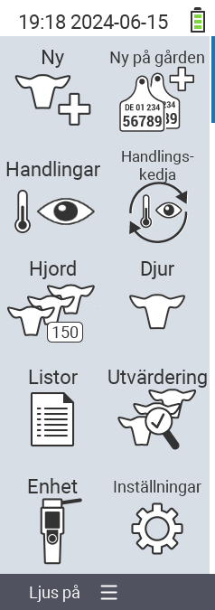

{}
Om du klickar på ett menyalternativ kommer du att omdirigeras till en beskrivning av respektive funktion.
{}

<map name="workmap">
  <area shape="rect" coords="3,40,116,160" alt="Ny" title="Skapa nya djur&#10;Mus klick: öppna dokumentation" href="/en/docs/new/">
  <area shape="rect" coords="3,160,116,280" alt="Åtgärder" title="Åtgärder på djur&#10;Mus klick: öppna dokumentation" href="/en/docs/actions/">
  <area shape="rect" coords="3,280,116,400" alt="Besättning" title="Besättningsmeny&#10;Mus klick: öppna dokumentation" href="/en/docs/herd/">
  <area shape="rect" coords="3,400,116,520" alt="Listor" title="Djurlistor&#10;Mus klick: öppna dokumentation" href="/en/docs/lists/">
  <area shape="rect" coords="3,520,116,634" alt="Enhet" title="Enhet&#10;Mus klick: öppna dokumentation" href="/en/docs/device/">

  <area shape="rect" coords="116,40,230,160" alt="Ny på gården" title="Tillgång till djur&#10;Mus klick: öppna dokumentation" href="/en/docs/new-on-farm/">
  <area shape="rect" coords="116,160,230,280" alt="Åtgärdskedja" title="Åtgärdskedja&#10;Mus klick: öppna dokumentation" href="/en/docs/chain-of-actions/">
  <area shape="rect" coords="116,280,230,400" alt="Djur" title="Djur&#10;Mus klick: öppna dokumentation" href="/en/docs/animal/">
  <area shape="rect" coords="116,400,230,520" alt="Utvärdering" title="Utvärdering&#10;Mus klick: öppna dokumentation" href="/en/docs/evaluation/">
  <area shape="rect" coords="116,520,230,634" alt="Inställningar" title="Inställningar&#10;Mus klick: öppna dokumentation" href="/en/docs/settings/">
</map>
