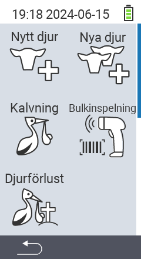

Via huvudmenyalternativet  `` kommer du till en undermeny, där 5 underpunkter presenteras för val:

<map name="workmap">
  <area shape="rect" coords="3,40,116,160" alt="New animal" title="Hur man registrerar ett nytt djur med VitalControl-enheten&#10;Mus klick: öppna dokumentation" href="/en/docs/new/animal/">
  <area shape="rect" coords="3,160,116,280" alt="Calving" title="Hur man registrerar en ny kalvning med VitalControl-enheten&#10;Mus klick: öppna dokumentation" href="/en/docs/new/calving/">
  <area shape="rect" coords="3,280,116,399" alt="Animal loss" title="Hur man registrerar förlusten av ett djur med VitalControl-enheten&#10;Mus klick: öppna dokumentation" href="/en/docs/new/animal-loss/">

  <area shape="rect" coords="116,40,230,160" alt="New animals" title="Hur man skapar flera nya djur på VitalControl-enheten med en enda åtgärd&#10;Mus klick: öppna dokumentation" href="/en/docs/new/animals/">
  <area shape="rect" coords="116,160,230,280" alt="Bulk recording" title="Använd streckkodsläsaren för att registrera en mängd djur&#10;Mus klick: öppna dokumentation" href="/en/docs/new/bulk-recording/">

  <area shape="rect" coords="1,401,100,439" alt="Back" title="Hoppa tillbaka en nivå&#10;Mus klick: till dokumentationen" href="/en/docs/menu/mainmenu/">
</map>

{}
Varje undermeny har sin egen ikon. Flytta muspekaren över en ikon i grafiken ovan och låt den vila en stund. En verktygstips visas, som visar information för den valda undermenyn. Om du klickar på en av ikonerna, kommer du att vidarebefordras till en beskrivning av den valda undermenypunkten.
{}

