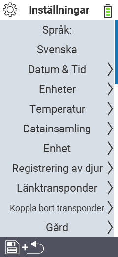

{}
Om du klickar på ett menyobjekt kommer du att omdirigeras till en beskrivning av respektive funktion.
{}

<map name="workmap">
  <area shape="rect" coords="2,40,230,120" alt="Språk" title="Ställ in och lagra språket för användargränssnittet permanent på din VitalControl-enhet&#10;Mus klick: öppna dokumentation" href="/en/docs/settings/language/">
  <area shape="rect" coords="2,120,230,160" alt="Datum & Tid" title="Här ställer du in datum och tid&#10;Mus klick: öppna dokumentation" href="/en/docs/settings/datetime/">
  <area shape="rect" coords="2,160,230,200" alt="Enheter" title="Här väljer du enheter för temperatur och massa&#10;Mus klick: öppna dokumentation" href="/en/docs/settings/units/">
  <area shape="rect" coords="2,200,230,240" alt="Temperatur" title="Ställ in temperaturinställningarna för användningen av din VitalControl-enhet&#10;Mus klick: öppna dokumentation" href="/en/docs/settings/temperature/">
   <area shape="rect" coords="2,240,230,280" alt="Datainsamling" title="Här lagrar du relevant information för insamling av djurdata&#10;Mus klick: öppna dokumentation" href="/en/docs/settings/data-acquisition/">
   <area shape="rect" coords="2,280,230,320" alt="Enhet" title="Här kan du justera olika enhetsinställningar&#10;Mausklick: zur Dokumentation" href="/en/docs/settings/device/">
   <area shape="rect" coords="2,320,230,360" alt="Registrering av djur" title="Här kan du justera flera fabriksinställda standarder angående registrering av nya djur till kraven på din gård.&#10;Mus klick: öppna dokumentation" href="/en/docs/settings/animal-registration/">
   <area shape="rect" coords="2,360,230,400" alt="Länka transponder" title="Ställ in tilldelningen av transpondern på din VitalControl-enhet&#10;Mus klick: öppna dokumentation" href="/en/docs/settings/transponder-linkage/">
   <area shape="rect" coords="2,400,230,439" alt="Avlänka transponder" title="Ange hur djur-ID kommer att tilldelas efter att transpondern har tagits bort&#10;Mus klick: öppna dokumentation" href="/en/docs/settings/transponder-linkage/">
   <area shape="rect" coords="2,440,230,480" alt="Gård" title="Spara ditt officiella tolv siffriga nationella gårds-ID permanent på VitalControl-enheten&#10;Mus klick: öppna dokumentation" href="/en/docs/settings/farm-number/">
   <area shape="rect" coords="2,482,123,519" alt="Tillbaka" title="Hoppa tillbaka en nivå" href="/en/docs/menu/mainmenu/">
</map>

