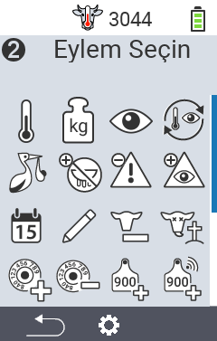
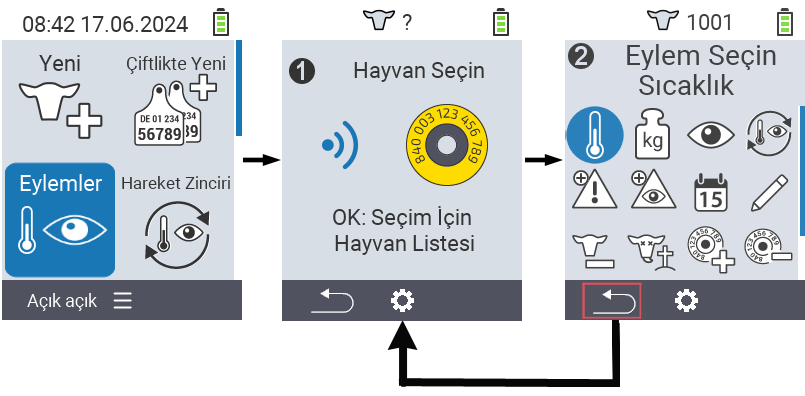

## Mevcut işlemler {#available-actions}

Hayvan türüne bağlı olarak, bir hayvan için 16 farklı işlem gerçekleştirebilirsiniz.

<map name="workmap">
  <area shape="rect" coords="3,100,60,165" alt="Sıcaklık" title="Hayvanlarınızın ateşini ölçün&#10;Fare tıklaması: belgeleri aç" href="/tr/docs/actions/measure-temperature/">
  <area shape="rect" coords="60,100,118,165" alt="Tartım" title="Hayvanlarınızın ağırlığını kaydedin&#10;Fare tıklaması: belgeleri aç" href="/tr/docs/actions/record-weight/">
  <area shape="rect" coords="118,100,174,165" alt="Değerlendirme" title="Hayvanlarınızı değerlendirin&#10;Fare tıklaması: belgeleri aç" href="/tr/docs/actions/rating/">
  <area shape="rect" coords="174,100,230,165" alt="İşlem zinciri" title="İşlem zincirini uygulama ve ayarlama&#10;Fare tıklaması: belgeleri aç" href="/tr/docs/chain-of-actions/">
   <area shape="rect" coords="3,165,60,225" alt="Doğum" title="Bir doğumu kaydedin&#10;Fare tıklaması: belgeleri aç" href="/tr/docs/actions/calving/">
   <area shape="rect" coords="60,165,120,225" alt="Kurutma" title="Bir ineği kurutun veya taze inekler listesine ekleyin&#10;Fare tıklaması: belgeleri aç" href="/tr/docs/actions/dry-off/">
   <area shape="rect" coords="120,165,175,225" alt="Alarm" title="Hayvanları alarm listesine ekleyin ve çıkarın&#10;Fare tıklaması: belgeleri aç" href="/tr/docs/actions/alarm/">
   <area shape="rect" coords="175,165,230,225" alt="Gözetim altında" title="Hayvanları gözetim listesine ekleyin veya çıkarın&#10;Fare tıklaması: belgeleri aç" href="/tr/docs/actions/on-watch/">
   <area shape="rect" coords="3,225,60,280" alt="Hayvan geçmişi" title="Bir hayvanın geçmişini görüntüleyin&#10;Fare tıklaması: belgeleri aç" href="/tr/docs/actions/animal-history/">
   <area shape="rect" coords="60,225,120,280" alt="Düzenle" title="Seçilen hayvanın verilerini düzenleyin&#10;Fare tıklaması: belgeleri aç" href="/tr/docs/actions/edit/">
   <area shape="rect" coords="120,225,175,280" alt="Kaydı sil" title="Bir hayvanın kaydını silin&#10;Fare tıklaması: belgeleri aç" href="/tr/docs/actions/unregister/">
   <area shape="rect" coords="175,225,230,280" alt="Hayvan kaybı" title="Bir hayvan kaybını kaydedin&#10;Fare tıklaması: belgeleri aç" href="/tr/docs/actions/animal-loss/">
   <area shape="rect" coords="3,280,60,337" alt="Transponder bağla" title="Bir hayvana transponder atayın&#10;Fare tıklaması: belgeleri aç" href="/tr/docs/actions/link-transponder/">
   <area shape="rect" coords="55,280,120,337" alt="Transponder bağlantısını kaldır" title="Bir hayvanın transponder bağlantısını kaldırın&#10;Fare tıklaması: belgeleri aç" href="/tr/docs/actions/unlink-transponder/">
   <area shape="rect" coords="120,280,175,337" alt="Hayvan kimliğini manuel olarak bağla" title="Ulusal hayvan kimliği olmayan bir hayvana ulusal hayvan kimliği atayın&#10;Fare tıklaması: belgeleri aç" href="/tr/docs/actions/link-animal-id/#link-animal-id">
   <area shape="rect" coords="175,280,230,337" alt="Tarama ile hayvan kimliğini bağla" title="Ulusal hayvan kimliği olmayan bir hayvana ulusal hayvan kimliği atayın&#10;Fare tıklaması: belgeleri aç" href="/tr/docs/actions/link-animal-id/#link-animal-id-with-electronic-ear-tag-scan">

   <area shape="rect" coords="100,340,140,375" alt="Ayarlar" title="Ayarları aç&#10;Fare tıklaması: belgeler" href="/tr/docs/actions/setting/">
</map>

{}
Her eylem bir sembol ile tanımlanır. Aşağıdaki grafikte bir sembolün üzerine fare imlecini getirin ve bir an için bekletin. İlgili eylem hakkında bilgi veren bir araç ipucu belirir. Sembollerden birine tıklarsanız, ilgili eylemin açıklamasına yönlendirilirsiniz.
{}

## Genel prosedür {#general-procedure}

Menü içinde  `` menü öğesini terk etmeden istediğiniz zaman bir sonraki hayvanı seçebilirsiniz. Bir sonraki hayvanı seçmek için şu adımları izleyin:

1. VitalControl cihazınızın ana ekranında  `` menü öğesini seçin ve `` düğmesine basın.

2. Ya bir hayvanı transponder ile tarayın ya da listeden bir hayvan seçin. `` düğmesine basarak onaylayın ve ok düğmeleri △ ▽ ile bir hayvan seçin. `` ile onaylayın.

3. Bir alt menü açılır ve burada birçok hayvan eylemi için simgeler bulabilirsiniz. İstediğiniz eylemi seçmek için ok düğmelerini kullanın ve `` düğmesine basarak eylemi başlatın. Seçilen eyleme bağlı olarak, bir veya daha fazla ekran veya bir açılır pencere görünecektir.

4. İsterseniz, mevcut hayvan için başka bir eylem seçebilir ve gerçekleştirebilirsiniz.

5. Hayvan için istediğiniz eylemi gerçekleştirdikten sonra, adım 2 'Hayvan seçimi'ne geri dönün. Bunu yapmak için, altbilginin sol alt köşesindeki `` simgesinin altındaki sol düğme `F1`e basın.

6. İkinci adımdaki pencere otomatik olarak tekrar açılacak ve bir sonraki hayvanı seçebilir veya `` simgesinin altındaki `F1` düğmesine basarak ana menüye dönebilirsiniz.



{}

{}
{}

{}


