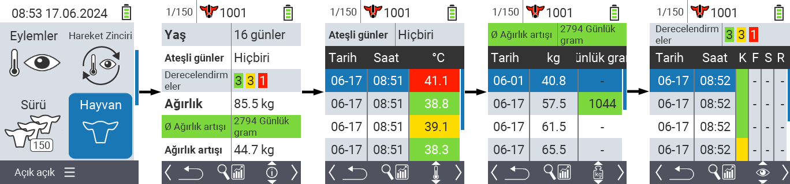
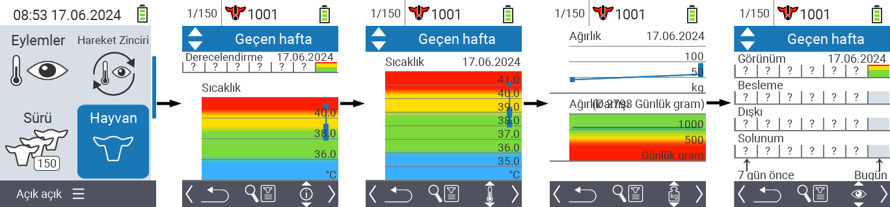
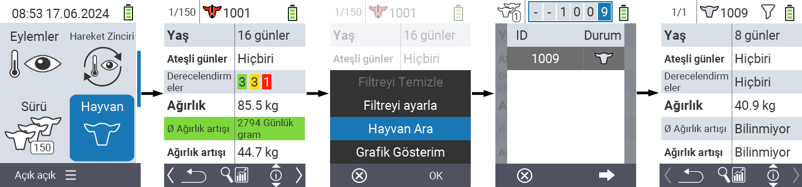
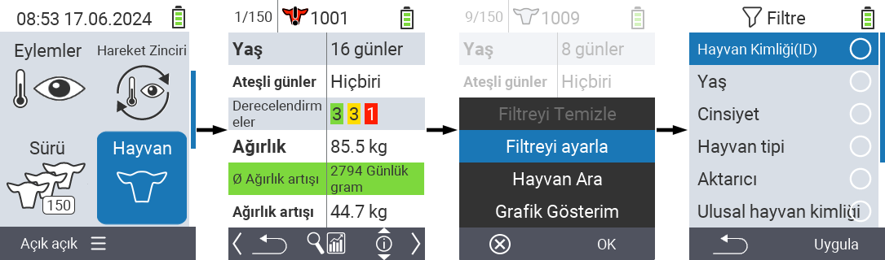

## Hayvan {#animal}

Bireysel hayvan fonksiyonu, her bir hayvanın ağırlığı, sıcaklığı ve derecelendirmesi hakkında önemli bilgileri görüntülemenizi sağlar. Bilgileri her zaman grafik veya liste olarak görüntüleme seçeneğiniz vardır. Tek hayvan fonksiyonunu kullanmak için şu adımları izleyin:

1. VitalControl cihazınızın ana ekranında,  `` menü öğesini seçin ve `` düğmesine basın.

2. En önemli hayvan bilgilerinin bir özeti açılır. Ekranın üst kenarı, şu anda hangi hayvanı görüntülediğinizi gösterir. `F3` tuşunu kullanarak hayvan bilgileri , sıcaklık , ağırlık  ve derecelendirme  arasında seçim yapabilirsiniz.

{}
Her bilgi ekranında [bir hayvan arama](#search-animal), [filtre ayarlama](#set-filter) ve [grafiksel görünüme geçme](#set-graphical-view) seçeneğiniz vardır.
Ayrıca, ok tuşlarını ◁ ▷ kullanarak her zaman bireysel hayvanlar arasında geçiş yapabilirsiniz.
{}

### Grafiksel görünüm ayarla {#set-graphical-view}

1. Bir açılır menü açmak için orta üst `Aç/Kapa` düğmesine  basın. Bu menüde, ``, `` veya `` fonksiyonları arasında seçim yapabilirsiniz.

2. `` öğesini ok tuşları △ ▽ ile seçin ve `` ile onaylayın.

### Hayvan arama {#search-animal}

1. Bir açılır menü açmak için orta üst `Aç/Kapa` düğmesine  basın. Bu menüde ``, `` veya `` işlevleri arasında seçim yapabilirsiniz.

2. `` öğesini ok tuşları △ ▽ ile seçin ve `` ile onaylayın.

3. İstenilen hayvan numarasını seçmek için ok tuşlarını △ ▽ ◁ ▷ kullanın ve `` ile onaylayın.

### Filtre ayarla {#set-filter}

1. Bir açılır menü açmak için orta üst `Aç/Kapa` düğmesine  basın. Bu menüde ``, `` veya `` işlevleri arasında seçim yapabilirsiniz.

2. `` öğesini ok tuşları △ ▽ ile seçin ve `` ile onaylayın.
Filtreyi nasıl kullanacağınızla ilgili talimatları [buradan]() alabilirsiniz.

