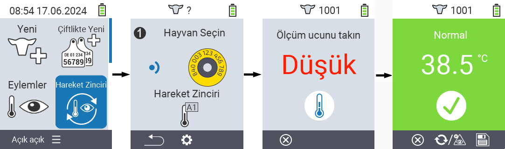
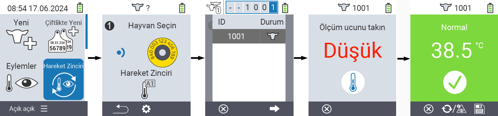

## Eylem Zinciri {#chain-of-actions}

Eylem zinciri, bir hayvan için birbiri ardına otomatik olarak birkaç eylemi gerçekleştirmenizi sağlar. Örneğin, `` ve `` eylemlerini seçebilirsiniz. Daha sonra eylem zincirini gerçekleştirdiğinizde, önce hayvanınızın sıcaklığını ölçebilir ve hemen ardından derecelendirmeyi kaydedebilirsiniz.

### Eylem Zincirini Kullan {#use-chain-of-actions}

1. VitalControl cihazınızın ana ekranında, menü öğesini seçin &nbsp;&nbsp; `` ve `` düğmesine basın.

2. Ya transponder kullanarak bir hayvanı tarayın ya da `` ile onaylayın ve istenen hayvan kimliğini girmek için ok tuşlarını △ ▽ ◁ ▷ kullanın.

3. Eylem zinciri şimdi yürütülüyor. Eylem zincirindeki tüm eylemler gerçekleştirildiğinde, doğrudan bir sonraki hayvan seçilebilir.



{}

{}
{}

{}


### Eylem Zincirini Ayarla {#set-chain-of-actions}

1. VitalControl cihazınızın ana ekranında, menü öğesini seçin &nbsp;&nbsp; `` ve `` düğmesine basın.

2. `F2` düğmesini kullanın &nbsp;&nbsp; (``).

3. Bir kaplama ekranı açılır. Listelenen eylemler arasında seçim yapmak için ok tuşlarını △ ▽ kullanın 1 - 4 (ardışık olarak dört eyleme kadar gerçekleştirebilirsiniz). İlgili eylem için istenen eylemi seçmek için ok tuşlarını ◁ ▷ kullanın. Ayarları `F1` tuşu ile kaydedin &nbsp;&nbsp;.

4. Tüm eylem zincirini sıfırlamak istiyorsanız, alt menüdeki `` seçeneğini ok tuşları △ ▽ kullanarak seçin ve `` ile onaylayın.

    

{}
Bireysel eylemler içinde, her bir eylem için [Eylemler](../actions) bölümünde açıklandığı gibi aynı ayar seçeneklerine sahipsiniz.
{}

{}
Eylem zincirinin başlangıç ekranındaki semboller, hangi eylemleri ayarladığınızı ve hangi sırayla olduğunu gösterir.
{}
