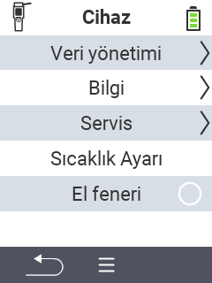

{}
Bir menü öğesine tıklarsanız, ilgili işlevin açıklamasına yönlendirileceksiniz.
{}

<map name="workmap">
  <area shape="rect" coords="2,40,238,80" alt="Veri yönetimi" title="Veri yedeklemeleri çalıştırın, verilerinizi dışa aktarın ve cihazı sıfırlayın&#10;Fare tıklaması: belgeleri aç" href="/en/docs/device/data-management/">
  <area shape="rect" coords="2,80,238,120" alt="Bilgi" title="Önemli yazılım ve donanım bilgilerini görüntüleyin&#10;Fare tıklaması: belgeleri aç" href="/en/docs/device/info/">
  <area shape="rect" coords="2,120,238,160" alt="Servis" title="Cihaz sürücülerinizi kontrol edin, ürün yazılımınızı güncelleyin ve menzil testi yapın&#10;Fare tıklaması: belgeleri aç" href="/en/docs/device/service/">
  <area shape="rect" coords="2,160,238,200" alt="Sıcaklık ölçümü" title="Cihazınızın sıcaklık ölçümünü test edin&#10;Fare tıklaması: belgeleri aç" href="/en/docs/device/temperature-measurement/">
  <area shape="rect" coords="2,200,238,240" alt="Fener" title="VitalControl cihazınızdaki ışığı açın veya kapatın&#10;Fare tıklaması: belgeleri aç" href="/en/docs/device/flashlight/">

  <area shape="rect" coords="2,282,97,318" alt="Geri" title="Bir seviye geri git" href="/en/docs/menu/mainmenu/">
</map>
