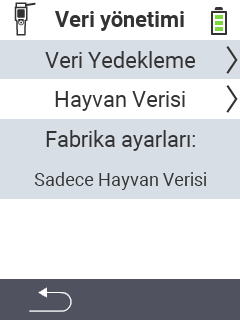

{}
Bir menü öğesine tıklarsanız, ilgili işlevin açıklamasına yönlendirilirsiniz.
{}

<map name="workmap">
  <area shape="rect" coords="2,40,238,80" alt="Veri yedekleme" title="Yedek oluşturma talimatlarını burada bulabilirsiniz&#10;Fare tıklaması: belgeleri aç" href="/en/docs/device/data-management/data-backup/">

  <area shape="rect" coords="2,80,238,120" alt="Hayvan verileri" title="Yedek geri yükleme talimatlarını burada bulabilirsiniz&#10;Fare tıklaması: belgeleri aç" href="/en/docs/device/data-management/animal-data/">

  <area shape="rect" coords="2,120,238,200" alt="Fabrika ayarlarına sıfırla" title="Cihazı ve hayvan verilerini sıfırlama ile ilgili tüm bilgileri ve talimatları burada bulabilirsiniz&#10;Fare tıklaması: belgeleri aç" href="/en/docs/reset/">

  <area shape="rect" coords="2,282,120,319" alt="Geri" title="Hayvan verilerini dışa aktarma ile ilgili tüm bilgileri ve talimatları burada bulabilirsiniz&#10;Fare tıklaması: belgeleri aç" href="/en/docs/device/">
</map>
