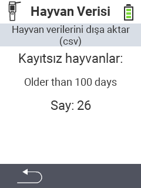

<map name="workmap">
  <area shape="rect" coords="2,40,238,80" alt="Hayvan verilerini dışa aktar (csv)" title="Hayvan verilerinizi dışa aktarın&#10;Fare tıklaması: belgeleri aç" href="/en/docs/data-export/usb-drive/">

  <area shape="rect" coords="2,80,238,200" alt="Hayvanları kayıttan çıkar" title="Hayvanların hangi yaştan itibaren kayıttan çıkarılacağını belirtin&#10;Fare tıklaması: belgeleri aç" href="/en/docs/device/data-management/animal-data/unregister-animal/">

  <area shape="rect" coords="2,282,120,319" alt="Geri" title="Hayvan verilerini dışa aktarma ile ilgili tüm bilgi ve talimatlar burada bulunabilir&#10;Fare tıklaması: belgeleri aç" href="/en/docs/device/data-management/">
</map>
