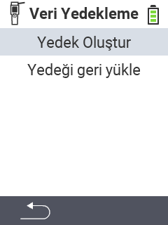

<map name="workmap">
  <area shape="rect" coords="2,40,238,80" alt="Yedek oluştur" title="Yedek oluşturma talimatlarını burada bulabilirsiniz&#10;Fare tıklaması: belgeleri aç" href="/tr/docs/backup/backup/">

  <area shape="rect" coords="2,80,238,120" alt="Yedeği geri yükle" title="Yedeği geri yükleme talimatlarını burada bulabilirsiniz&#10;Fare tıklaması: belgeleri aç" href="/tr/docs/backup/restore/">

  <area shape="rect" coords="2,282,120,319" alt="Geri" title="Bir seviye geri git&#10;Fare tıklaması: belgeleri aç" href="/tr/docs/device/data-management/">
</map>
