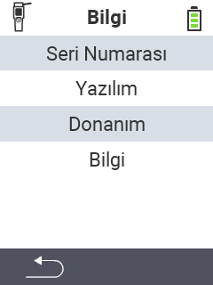

{}
Bir menü öğesine tıklarsanız, ilgili işlevin açıklamasına yönlendirilirsiniz.
{}

<map name="workmap">
  <area shape="rect" coords="2,40,238,80" alt="Seri numarası" title="Cihazınızın seri numarasını almak için buraya tıklayın&#10;Mausklick: zur Dokumentation" href="/tr/docs/device/info/serial-number/">
  <area shape="rect" coords="2,80,238,120" alt="Yazılım" title="Yazılım sürümünüzü görüntüleme talimatlarını burada bulabilirsiniz&#10;Mausklick: zur Dokumentation" href="/tr/docs/firmware/versions/">
  <area shape="rect" coords="2,120,238,160" alt="Donanım" title="Cihazınızın donanım bilgilerine erişmek için buraya tıklayın&#10;Mausklick: zur Dokumentation" href="/tr/docs/device/info/hardware/">
  <area shape="rect" coords="2,160,238,200" alt="Hakkında" title="Satıcı bilgilerini çağırın&#10;Mausklick: zur Dokumentation" href="/tr/docs/device/info/about/">

  <area shape="rect" coords="2,282,120,319" alt="Geri" title="Seviyeye geri dön&#10;Mouse click: open documentation" href="/tr/docs/device/">
</map>
