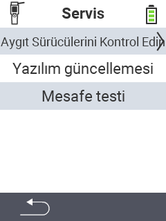

{}
Bir menü öğesine tıklarsanız, ilgili işlevin açıklamasına yönlendirileceksiniz.
{}

<map name="workmap">
  <area shape="rect" coords="2,42,238,82" alt="Cihaz sürücülerini kontrol et" title="Cihaz sürücülerinizi kontrol etme talimatlarını burada bulabilirsiniz&#10;Fare tıklaması: belgeleri aç" href="/en/docs/diagnosis/hardware/">
  <area shape="rect" coords="2,82,238,122" alt="Donanım yazılımı güncellemesi" title="Donanım yazılımınızı güncelleme talimatlarını burada bulabilirsiniz&#10;Fare tıklaması: belgeleri aç" href="/en/docs/firmware/update/">
  <area shape="rect" coords="2,122,238,162" alt="Menzil testi" title="Menzil testi yapma talimatlarını burada bulabilirsiniz&#10;Fare tıklaması: belgeleri aç" href="/en/docs/diagnosis/rfid-scan/">

  <area shape="rect" coords="2,282,120,319" alt="Geri" title="Seviyeye geri dön&#10;Fare tıklaması: belgeleri aç" href="/en/docs/device/">
</map>
