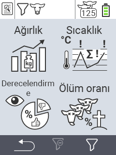

{}
Bir menü öğesine tıklarsanız, ilgili işlevin açıklamasına yönlendirilirsiniz.
{}

<map name="workmap">
  <area shape="rect" coords="3,40,116,160" alt="Ağırlık" title="Depolanan verilerinizi Ağırlık bölümünde değerlendirin&#10;Fare tıklaması: belgeleri aç" href="/tr/docs/evaluation/weight/">
  <area shape="rect" coords="3,160,116,279" alt="Değerlendirme" title="Depolanan verilerinizi değerlendirme bölümünde değerlendirin&#10;Fare tıklaması: belgeleri aç" href="/tr/docs/evaluation/rating/">

  <area shape="rect" coords="116,40,238,160" alt="Sıcaklık" title="Depolanan verilerinizi Sıcaklık bölümünde değerlendirin&#10;Fare tıklaması: belgeleri aç" href="/tr/docs/evaluation/temperature/">
  <area shape="rect" coords="116,160,238,279" alt="Ölüm Oranı" title="Depolanan verilerinizi ölüm oranı bölümünde değerlendirin&#10;Fare tıklaması: belgeleri aç" href="/tr/docs/evaluation/mortality/">

  <area shape="rect" coords="150,282,238,319" alt="Filtre" title="Bir filtre ayarlayın&#10;Fare tıklaması: belgeleri aç" href="/tr/docs/filter">
  <area shape="rect" coords="2,282,95,319" alt="Geri" title="Bir seviye geri git&#10;Fare tıklaması: belgeleri aç" href="/tr/docs/menu/mainmenu/">
</map>
