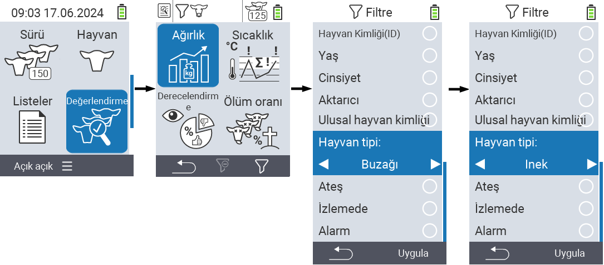
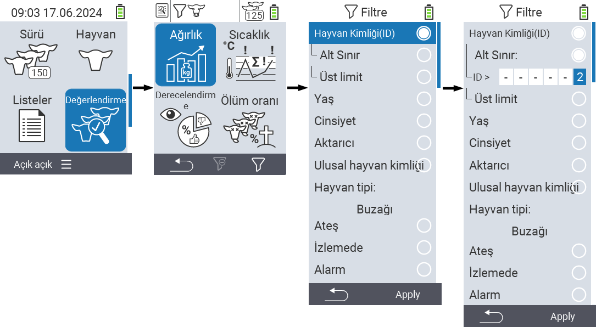
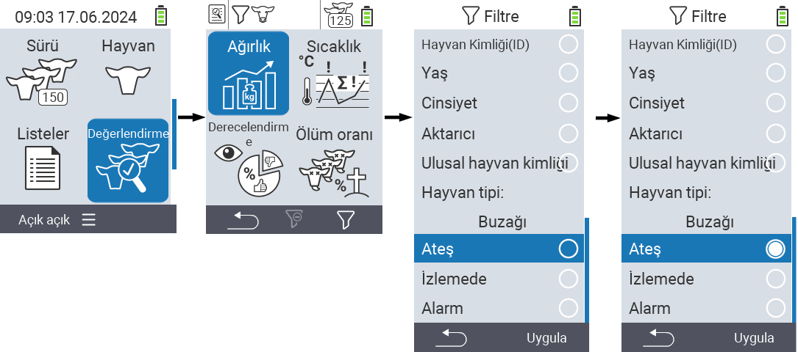

## Filtreleri uygulama {#applying-filters}

{}
Filtre, VitalControl cihazının ``, `` ve `` menü öğeleri içinde filtre kriterlerini kullanarak bir seçim yapmanıza yardımcı olur. Bir filtre uyguladığınız anda, ekranın üst kısmında çeşitli filtre kriterleri için semboller görünür. Bu semboller, hangi filtre kriterlerinin etkinleştirildiğini ve hangilerinin etkinleştirildiğini anlamanıza yardımcı olur. Örneğin, `` filtresini erkek olarak ayarlarsanız, cihaz yalnızca erkek hayvanları kullanır. Örneğin, `` filtresini de etkinleştirirseniz, cihaz yalnızca gözlem listesinde olan erkek hayvanları kullanır.
{}

Değerlendirmelerde bir filtre oluşturmak için şu adımları izleyin:

1. Üst menü öğesine ait alt menüde  `` `F3` tuşuna  bir kez basın. Üst menü öğelerine ait alt menüde  `` ve  ``, tuşa iki kez basmanız gerekir.

2. Tüm filtre seçeneklerini ayarlayabileceğiniz bir alt menü açılır. ``, ``, ``, ``, ``, ``, ``, `` ve `` ile filtreleyebilirsiniz.

3. ``, ``, `` ve `` filtreleri için ilgili alana gidin ve `` ile onaylayın. İstenilen ayarı belirtmek için ok tuşlarını ◁ ▷ kullanın. Seçilen ayarı uygulamak için `F3` tuşunu `` kullanın. Filtre değişikliklerinizi iptal etmek için `F1` tuşuna &nbsp;&nbsp; basın.

4. `` ve `` filtreleri için ilgili kriteri seçin ve `` ile onaylayın. Şimdi size bir alt ve üst limit gösterilecektir. Ok tuşlarını △ ▽ kullanarak istediğiniz limite gidin ve `` tuşuna iki kez basarak onaylayın. Şimdi ok tuşlarını ◁ ▷ ve ok tuşlarını △ ▽ kullanarak istediğiniz sayıyı ayarlayabilirsiniz. Tüm ayarlar doğru olduğunda, ayar modundan çıkmak ve seçilen filtreyi/filtreleri `F3` tuşu `` ile uygulamak için tekrar `` tuşuna basın. İsterseniz değişikliklerinizi iptal etmek için `F1` tuşunu &nbsp;&nbsp; kullanabilirsiniz.

5. ``, `` ve `` filtreleri için uygulamalarını devre dışı bırakma veya etkinleştirme olanağı vardır. Bunu yapmak için ilgili filtreyi seçin ve `` ile onaylayın. Filtre şimdi aktiftir. Filtreyi devre dışı bırakmak için tekrar `` ile onaylayın.

6. Tüm filtreleri ayarladıktan sonra, tanımlanan filtreleri yerine koymak için `F3` tuşu `` kullanın veya filtre(ler)deki değişikliklerinizi iptal etmek için `F1` tuşuna  basın.
