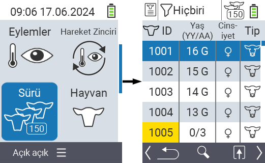
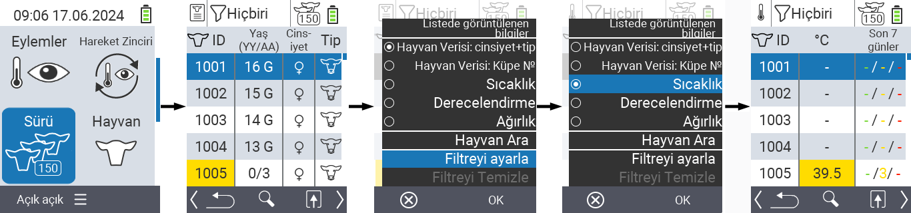
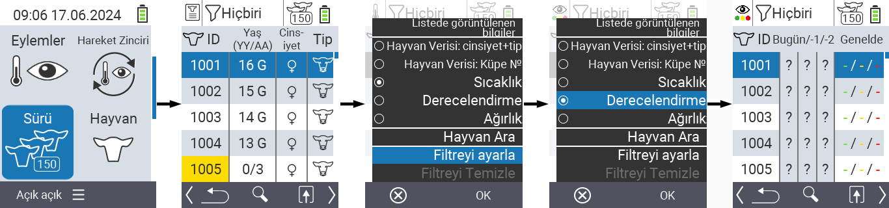
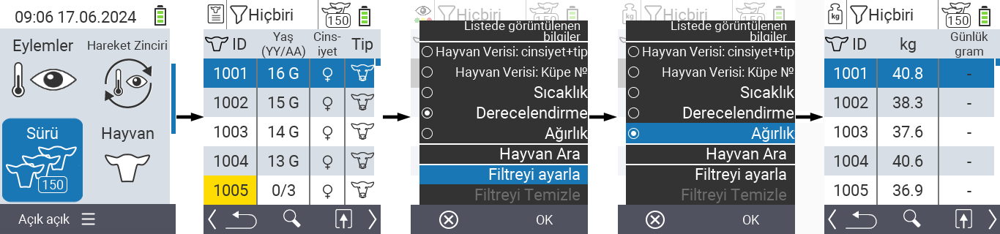
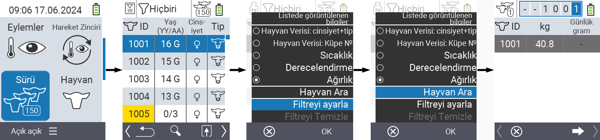
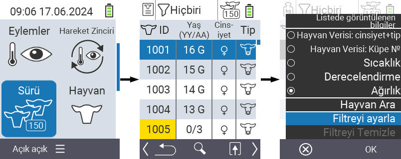
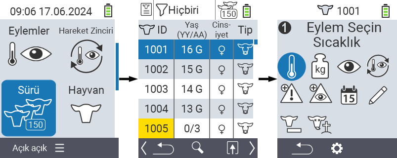

## Sürü {#herd}

Sürü menü öğesi içinde, tüm sürünüzü görüntüleyebilir, bireysel hayvanları arayabilir ve önemli bilgileri görüntüleyebilirsiniz. Aşağıdaki imkanlara sahipsiniz:

- [Hayvan verilerini](#view-animal-data) görüntüleyin
- [Sıcaklık verilerini](#display-temperature) görüntüleyin
- [Derecelendirme verilerini](#view-rating) görüntüleyin
- [Ağırlık verilerini](#view-rating) görüntüleyin
- [Hayvan arayın](#search-animal)
- [Filtre](#set-filter) ayarlayın
- [Eylemler](#call-action-menu)

### Hazırlık adımları {#preparatory-steps}

1. VitalControl cihazınızın ana ekranında, menü öğesini seçin  `` ve `` düğmesine basın.

2. Sürü genel bakışınız açılır.

    

### Hayvan verilerini görüntüleyin {#view-animal-data}

1. Hazırlık adımlarını tamamlayın.

2. `F3` tuşunu kullanın &nbsp;&nbsp; sürü listesi için görüntülenebilecek bilgi kategorilerini listeleyen bir açılır menü çağırmak için. Ok tuşlarını △ ▽ kullanarak `` veya `` satırını vurgulayın ve merkezi `` düğmesine veya `F3` tuşuna `` basarak bu kategoriyi seçin. İki seçim seçeneği, bilgi çubuğunun görüntülenmesinde farklılık gösterir.

3. Hayvan verileri artık sürü listesi içeriği olarak görüntülenecektir.

4. Alternatif olarak, farklı görüntüleme seçenekleri arasında geçiş yapmak için ok tuşlarını ◁ ▷ kullanabilirsiniz.

    

{}
Varsayılan olarak, hayvan verileri ilk olarak görüntülenir. Örneğin, ağırlığı görüntülediğinizde, hayvan verilerinin görüntülenmesini tekrar ayarlamanız gerekir.
{}

### Sıcaklığı görüntüle {#display-temperature}

1. Hazırlık adımlarını tamamlayın.

2. Sürü listesi için görüntülenebilecek bilgi kategorilerini listeleyen bir açılır menüyü çağırmak için `F3` tuşunu &nbsp;&nbsp; kullanın. `` satırını vurgulamak için ok tuşlarını △ ▽ kullanın ve bu kategoriyi merkezi `` düğmesine veya `F3` tuşuna `` basarak seçin.

3. Sıcaklık verileri artık sürü listesi içeriği olarak görüntülenecektir.

4. Alternatif olarak, farklı görüntüleme seçenekleri arasında geçiş yapmak için ok tuşlarını ◁ ▷ kullanabilirsiniz.

    

### Değerlendirmeyi görüntüle {#view-rating}

1. Hazırlık adımlarını tamamlayın.

2. Sürü listesi için görüntülenebilecek bilgi kategorilerini listeleyen bir açılır menüyü çağırmak için `F3` tuşunu &nbsp;&nbsp; kullanın. `` satırını vurgulamak için ok tuşlarını △ ▽ kullanın ve bu kategoriyi merkezi `` düğmesine veya `F3` tuşuna `` basarak seçin.

3. Değerlendirme verileri artık sürü listesi içeriği olarak görüntülenecektir.

4. Alternatif olarak, farklı görüntüleme seçenekleri arasında geçiş yapmak için ok tuşlarını ◁ ▷ kullanabilirsiniz.

    

### Ağırlığı görüntüle {#display-weight}

1. Hazırlık adımlarını tamamlayın.

2. Sürü listesi için görüntülenebilecek bilgi kategorilerini listeleyen bir açılır menüyü çağırmak için `F3` tuşunu &nbsp;&nbsp; kullanın. `` satırını vurgulamak için ok tuşlarını △ ▽ kullanın ve bu kategoriyi merkezi `` düğmesine veya `F3` tuşuna `` basarak seçin.

3. Ağırlık verileri artık sürü listesi içeriği olarak görüntülenecektir.

4. Alternatif olarak, farklı görüntüleme seçenekleri arasında geçiş yapmak için ok tuşlarını ◁ ▷ kullanabilirsiniz.

    

### Hayvan ara {#search-animal}

1. Hazırlık adımlarını tamamlayın.

2. Çeşitli seçenekleri listeleyen bir açılır menüyü çağırmak için `F3` tuşunu kullanın &nbsp;&nbsp;. `` işlevini vurgulamak için ok tuşlarını △ ▽ kullanın ve arama işlevini merkezi `` tuşuna veya `F3` tuşuna `` basarak çağırın. Alternatif olarak, birinci adımdan hemen sonra `Aç/Kapa` düğmesini  kullanabilirsiniz.

3. İstenilen hayvan numarasını girmek için ok tuşlarını △ ▽ ◁ ▷ kullanın ve `` ile onaylayın.

    

### Filtre ayarla {#set-filter}

1. Hazırlık adımlarını tamamlayın.

2. Çeşitli seçenekleri listeleyen bir açılır menüyü çağırmak için `F3` tuşunu kullanın &nbsp;&nbsp;. `` işlevini vurgulamak için ok tuşlarını △ ▽ kullanın ve filtre işlevini merkezi `` tuşuna veya `F3` tuşuna `` basarak çağırın.

3. Filtrenin nasıl uygulanacağı [burada]() bulunabilir.

    

### Eylem menüsünü çağır {#call-action-menu}

Her zaman bir hayvan için eylem menüsünü çağırma seçeneğiniz vardır.

1. Hazırlık adımlarını tamamlayın.

2. Ok tuşları △ ▽ ile listeden bir hayvan seçin ve `` ile onaylayın.

3. Eylem menüsü şimdi açık. Nasıl kullanılacağı [burada](../actions) bulunabilir.

4. `F3` tuşu ile sürü listesine geri dönün.

    
