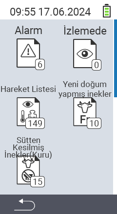

{}
Bir menü öğesine tıklarsanız, ilgili işlevin açıklamasına yönlendirilirsiniz.
{}

<map name="workmap">
  <area shape="rect" coords="3,40,116,160" alt="Alarm listesi" title="Alarm listenizi kontrol edin&#10;Fare tıklaması: dokümantasyonu aç" href="/tr/docs/lists/alarm/">
  <area shape="rect" coords="3,160,116,280" alt="Eylem listesi" title="Eylem listenizi kontrol edin&#10;Fare tıklaması: dokümantasyonu aç" href="/tr/docs/lists/actions/">
  <area shape="rect" coords="3,280,116,399" alt="Kuru inekler listesi" title="Kuru inekler listenizi kontrol edin&#10;Fare tıklaması: dokümantasyonu aç" href="/tr/docs/lists/dry-cows/">

  <area shape="rect" coords="116,40,230,160" alt="Gözetim listesi" title="Gözetim listenizi kontrol edin&#10;Fare tıklaması: dokümantasyonu aç" href="/tr/docs/lists/on-watch/">
  <area shape="rect" coords="116,160,230,280" alt="Taze inekler" title="Taze inekler listenizi kontrol edin&#10;Fare tıklaması: dokümantasyonu aç" href="/tr/docs/lists/fresh-cows/">

  <area shape="rect" coords="2,401,115,438" alt="Geri" title="Bir seviye geri git" href="/tr/docs/menu/mainmenu/">
</map>
