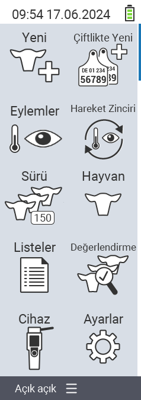

{}
Bir menü öğesine tıklarsanız, ilgili işlevin açıklamasına yönlendirilirsiniz.
{}

<map name="workmap">
  <area shape="rect" coords="3,40,116,160" alt="Yeni" title="Yeni hayvanlar oluştur&#10;Fare tıklaması: belgeleri aç" href="/en/docs/new/">
  <area shape="rect" coords="3,160,116,280" alt="Eylemler" title="Hayvanlar üzerinde eylemler&#10;Fare tıklaması: belgeleri aç" href="/en/docs/actions/">
  <area shape="rect" coords="3,280,116,400" alt="Sürü" title="Sürü menüsü&#10;Fare tıklaması: belgeleri aç" href="/en/docs/herd/">
  <area shape="rect" coords="3,400,116,520" alt="Listeler" title="Hayvan listeleri&#10;Fare tıklaması: belgeleri aç" href="/en/docs/lists/">
  <area shape="rect" coords="3,520,116,634" alt="Cihaz" title="Cihaz&#10;Fare tıklaması: belgeleri aç" href="/en/docs/device/">

  <area shape="rect" coords="116,40,230,160" alt="Çiftlikte yeni" title="Hayvanların erişimi&#10;Fare tıklaması: belgeleri aç" href="/en/docs/new-on-farm/">
  <area shape="rect" coords="116,160,230,280" alt="Eylem zinciri" title="Eylem zinciri&#10;Fare tıklaması: belgeleri aç" href="/en/docs/chain-of-actions/">
  <area shape="rect" coords="116,280,230,400" alt="Hayvan" title="Hayvan&#10;Fare tıklaması: belgeleri aç" href="/en/docs/animal/">
  <area shape="rect" coords="116,400,230,520" alt="Değerlendirme" title="Değerlendirme&#10;Fare tıklaması: belgeleri aç" href="/en/docs/evaluation/">
  <area shape="rect" coords="116,520,230,634" alt="Ayarlar" title="Ayarlar&#10;Fare tıklaması: belgeleri aç" href="/en/docs/settings/">
</map>
