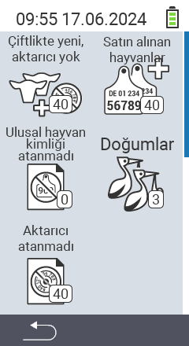

{}
Bir menü öğesine tıklarsanız, ilgili işlevin açıklamasına yönlendirilirsiniz.
{}

<map name="workmap">
  <area shape="rect" coords="3,40,116,160" alt="Çiftlikte yeni, transponder yok" title="Burada transponderi olmayan yeni hayvanlara bir transponder atarsınız&#10;Fare tıklaması: belgeleri aç" href="/tr/docs/new-on-farm/new-no-transponder/">
  <area shape="rect" coords="3,160,116,280" alt="Ulusal hayvan kimliği atanmadı" title="Burada henüz ulusal hayvan kimliği atanmamış tüm hayvanları görebilir ve ulusal hayvan kimliği atayabilirsiniz&#10;Fare tıklaması: belgeleri aç" href="/tr/docs/new-on-farm/no-national-animal-id-assigned/">
  <area shape="rect" coords="3,280,116,399" alt="Transponder atanmadı" title="Burada henüz transponder atanmamış tüm hayvanları görebilir ve onlara bir transponder atayabilirsiniz&#10;Fare tıklaması: belgeleri aç" href="/tr/docs/new-on-farm/no-transponder-assigned/">

  <area shape="rect" coords="116,40,230,160" alt="Satın alınan hayvanlar" title="Burada mevcut satın alımlarınızı görebilir ve verileri dışa aktarabilirsiniz&#10;Fare tıklaması: belgeleri aç" href="/tr/docs/new-on-farm/purchased-animals/">
  <area shape="rect" coords="116,160,230,280" alt="Doğumlar" title="Burada doğumlarınızı görebilir ve bir dışa aktarma dosyası oluşturabilirsiniz&#10;Fare tıklaması: belgeleri aç" href="/tr/docs/new-on-farm/births/">
  <area shape="rect" coords="1,401,100,439" alt="Geri" title="Bir seviye geri git&#10;Fare tıklaması: belgeleri aç" href="/tr/docs/menu/mainmenu/">
</map>
