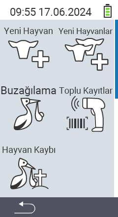

Ana menü öğesi  `` üzerinden, seçim için 5 alt öğenin sunulduğu bir alt menüye ulaşırsınız:

<map name="workmap">
  <area shape="rect" coords="3,40,116,160" alt="Yeni hayvan" title="VitalControl cihazını kullanarak yeni bir hayvanın nasıl kaydedileceği&#10;Fare tıklaması: dokümantasyonu aç" href="/tr/docs/new/animal/">
  <area shape="rect" coords="3,160,116,280" alt="Buzağılama" title="VitalControl cihazını kullanarak yeni bir buzağılama nasıl kaydedileceği&#10;Fare tıklaması: dokümantasyonu aç" href="/tr/docs/new/calving/">
  <area shape="rect" coords="3,280,116,399" alt="Hayvan kaybı" title="VitalControl cihazını kullanarak bir hayvan kaybının nasıl kaydedileceği&#10;Fare tıklaması: dokümantasyonu aç" href="/tr/docs/new/animal-loss/">

  <area shape="rect" coords="116,40,230,160" alt="Yeni hayvanlar" title="Tek bir işlemle VitalControl cihazında birden fazla yeni hayvan nasıl oluşturulacağı&#10;Fare tıklaması: dokümantasyonu aç" href="/tr/docs/new/animals/">
  <area shape="rect" coords="116,160,230,280" alt="Toplu kayıt" title="Barkod tarayıcıyı kullanarak çeşitli hayvanları kaydedin&#10;Fare tıklaması: dokümantasyonu aç" href="/tr/docs/new/bulk-recording/">

  <area shape="rect" coords="1,401,100,439" alt="Geri" title="Bir seviye geri git&#10;Fare tıklaması: dokümantasyona git" href="/tr/docs/menu/mainmenu/">
</map>

{}
Her alt menü kendi simgesini taşır. Yukarıdaki grafikte bir simgenin üzerine fare imlecini getirin ve bir an için bekletin. Seçilen alt menü öğesi için bilgi gösteren bir araç ipucu belirir. Simgelerden birine tıklarsanız, seçilen alt menü öğesinin açıklamasına yönlendirilirsiniz.
{}

