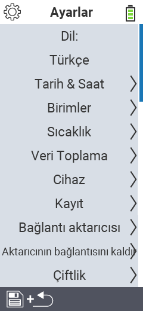

{}
Bir menü öğesine tıklarsanız, ilgili işlevin açıklamasına yönlendirilirsiniz.
{}

<map name="workmap">
  <area shape="rect" coords="2,40,230,120" alt="Dil" title="VitalControl cihazınızın kullanıcı arayüzünün dilini ayarlayın ve kalıcı olarak saklayın&#10;Fare tıklaması: belgeleri aç" href="/tr/docs/settings/language/">
  <area shape="rect" coords="2,120,230,160" alt="Tarih & Saat" title="Burada tarih ve saati ayarlarsınız&#10;Fare tıklaması: belgeleri aç" href="/tr/docs/settings/datetime/">
  <area shape="rect" coords="2,160,230,200" alt="Birimler" title="Burada sıcaklık ve kütle için birimleri seçersiniz&#10;Fare tıklaması: belgeleri aç" href="/tr/docs/settings/units/">
  <area shape="rect" coords="2,200,230,240" alt="Sıcaklık" title="VitalControl cihazınızın uygulama sıcaklık ayarlarını yapın&#10;Fare tıklaması: belgeleri aç" href="/tr/docs/settings/temperature/">
   <area shape="rect" coords="2,240,230,280" alt="Veri toplama" title="Hayvan veri toplama için ilgili bilgileri burada saklarsınız&#10;Fare tıklaması: belgeleri aç" href="/tr/docs/settings/data-acquisition/">
   <area shape="rect" coords="2,280,230,320" alt="Cihaz" title="Burada çeşitli cihaz ayarlarını yapabilirsiniz&#10;Fare tıklaması: belgeleri aç" href="/tr/docs/settings/device/">
   <area shape="rect" coords="2,320,230,360" alt="Hayvan kaydı" title="Yeni hayvanların kaydı ile ilgili fabrika ayarlarını çiftliğinizin gereksinimlerine göre ayarlayabilirsiniz.&#10;Fare tıklaması: belgeleri aç" href="/tr/docs/settings/animal-registration/">
   <area shape="rect" coords="2,360,230,400" alt="Transponder bağlama" title="VitalControl cihazınızda transponder atamasını ayarlayın&#10;Fare tıklaması: belgeleri aç" href="/tr/docs/settings/transponder-linkage/">
   <area shape="rect" coords="2,400,230,439" alt="Transponder bağlantısını kaldır" title="Transponder çıkarıldıktan sonra hayvan kimliğinin nasıl atanacağını belirtin&#10;Fare tıklaması: belgeleri aç" href="/tr/docs/settings/transponder-linkage/">
   <area shape="rect" coords="2,440,230,480" alt="Çiftlik" title="Resmi on iki haneli ulusal çiftlik kimliğinizi VitalControl cihazında kalıcı olarak saklayın&#10;Fare tıklaması: belgeleri aç" href="/tr/docs/settings/farm-number/">
   <area shape="rect" coords="2,482,123,519" alt="Geri" title="Bir seviye geri git" href="/tr/docs/menu/mainmenu/">
</map>

Lütfen Markdown içeriğini yapıştırın, ben de Türkçeye çevireyim.
