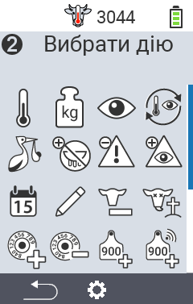
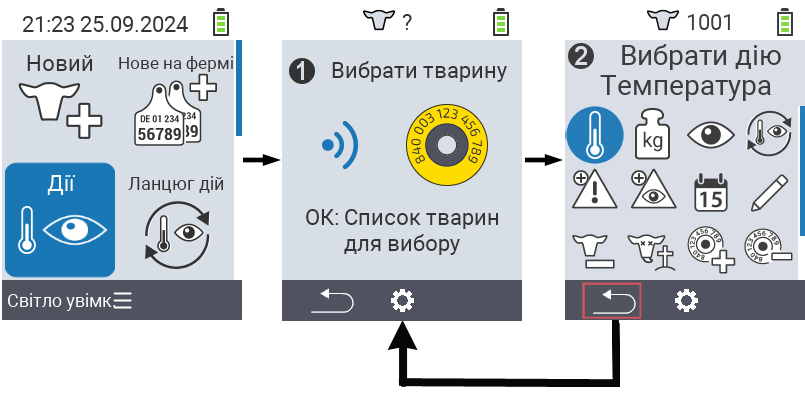
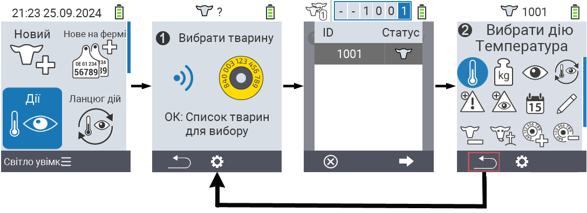

## Доступні дії {#available-actions}

Залежно від типу тварини, ви можете виконувати до 16 різних дій з твариною.

<map name="workmap">
  <area shape="rect" coords="3,100,60,165" alt="Температура" title="Вимірювання температури у ваших тварин&#10;Клік мишкою: відкрити документацію" href="/uk/docs/actions/measure-temperature/">
  <area shape="rect" coords="60,100,118,165" alt="Зважування" title="Запис ваги ваших тварин&#10;Клік мишкою: відкрити документацію" href="/uk/docs/actions/record-weight/">
  <area shape="rect" coords="118,100,174,165" alt="Оцінка" title="Оцінка ваших тварин&#10;Клік мишкою: відкрити документацію" href="/uk/docs/actions/rating/">
  <area shape="rect" coords="174,100,230,165" alt="Ланцюг дій" title="Застосування та налаштування ланцюга дій&#10;Клік мишкою: відкрити документацію" href="/uk/docs/chain-of-actions/">
   <area shape="rect" coords="3,165,60,225" alt="Отелення" title="Реєстрація отелення&#10;Клік мишкою: відкрити документацію" href="/uk/docs/actions/calving/">
   <area shape="rect" coords="60,165,120,225" alt="Запуск" title="Запуск корови або додавання її до списку свіжих корів&#10;Клік мишкою: відкрити документацію" href="/uk/docs/actions/dry-off/">
   <area shape="rect" coords="120,165,175,225" alt="Тривога" title="Додавання та видалення тварин зі списку тривоги&#10;Клік мишкою: відкрити документацію" href="/uk/docs/actions/alarm/">
   <area shape="rect" coords="175,165,230,225" alt="Під наглядом" title="Додавання тварин до списку під наглядом або їх видалення&#10;Клік мишкою: відкрити документацію" href="/uk/docs/actions/on-watch/">
   <area shape="rect" coords="3,225,60,280" alt="Історія тварини" title="Перегляд історії тварини&#10;Клік мишкою: відкрити документацію" href="/uk/docs/actions/animal-history/">
   <area shape="rect" coords="60,225,120,280" alt="Редагувати" title="Редагування даних вибраної тварини&#10;Клік мишкою: відкрити документацію" href="/uk/docs/actions/edit/">
   <area shape="rect" coords="120,225,175,280" alt="Видалити реєстрацію" title="Видалення реєстрації тварини&#10;Клік мишкою: відкрити документацію" href="/uk/docs/actions/unregister/">
   <area shape="rect" coords="175,225,230,280" alt="Втрати тварин" title="Реєстрація втрати тварини&#10;Клік мишкою: відкрити документацію" href="/uk/docs/actions/animal-loss/">
   <area shape="rect" coords="3,280,60,337" alt="Прив'язати транспондер" title="Призначення транспондера тварині&#10;Клік мишкою: відкрити документацію" href="/uk/docs/actions/link-transponder/">
   <area shape="rect" coords="55,280,120,337" alt="Відв'язати транспондер" title="Видалення прив'язки транспондера до тварини&#10;Клік мишкою: відкрити документацію" href="/uk/docs/actions/unlink-transponder/">
   <area shape="rect" coords="120,280,175,337" alt="Прив'язати ідентифікатор тварини вручну" title="Призначення національного ідентифікатора тварині, яка не має національного ідентифікатора&#10;Клік мишкою: відкрити документацію" href="/uk/docs/actions/link-animal-id/#link-animal-id">
   <area shape="rect" coords="175,280,230,337" alt="Прив'язати ідентифікатор тварини зі скануванням" title="Призначення національного ідентифікатора тварині, яка не має національного ідентифікатора&#10;Клік мишкою: відкрити документацію" href="/uk/docs/actions/link-animal-id/#link-animal-id-with-electronic-ear-tag-scan">

   <area shape="rect" coords="100,340,140,375" alt="Settings" title="Виклик налаштувань&#10;Клацніть мишею: до документації" href="/uk/docs/actions/setting/">
</map>

{}
Кожна дія позначена символом. Перемістіть вказівник миші на символ у графіку нижче і залиште його на мить. З'явиться підказка, яка надасть інформацію про відповідну дію. Якщо ви клацнете на один із символів, ви будете перенаправлені до опису відповідної дії.
{}

## Загальна процедура {#general-procedure}

У меню   `` ви можете вибрати наступну тварину в будь-який час, не виходячи з пункту меню Дії. Щоб вибрати наступну тварину, виконайте наступні дії:

1. Виберіть пункт меню   `` на головному екрані вашого пристрою VitalControl і натисніть кнопку ``.

2. Або відскануйте тварину за допомогою транспондера, або виберіть тварину зі списку. Підтвердіть, натиснувши `` і виберіть тварину за допомогою кнопок зі стрілками △ ▽. Підтвердіть, натиснувши ``.

3. Відкриється підменю, в якому ви знайдете значки для численних дій з тваринами. Використовуйте кнопки зі стрілками для вибору бажаної дії та почніть дію, натиснувши кнопку ``. Залежно від вибраної дії, з'явиться один або кілька екранів або спливаюче вікно.

4. Якщо бажаєте, ви можете зараз вибрати та виконати іншу дію для поточної тварини.

5. Після того, як ви виконали бажану(і) дію(ї) для тварини, поверніться до кроку 2 'Вибір тварини'. Для цього натисніть ліву кнопку `F1` під символом `` у нижньому лівому куті нижнього колонтитулу.

6. Вікно з кроку два відкриється знову автоматично, і ви можете вибрати наступну тварину або повернутися до головного меню, натиснувши кнопку `F1` під символом ``.



{}

{}
{}

{}


Please provide the Markdown content you would like translated into Ukrainian.
