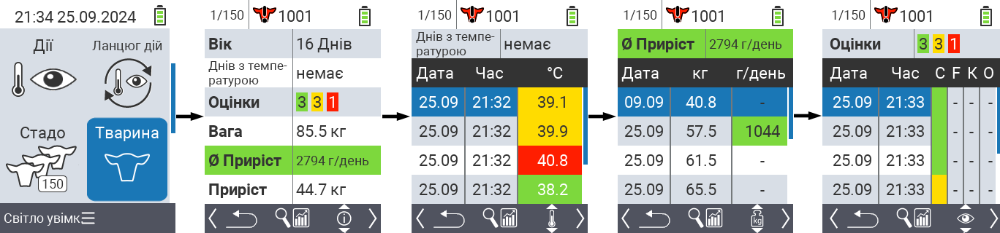
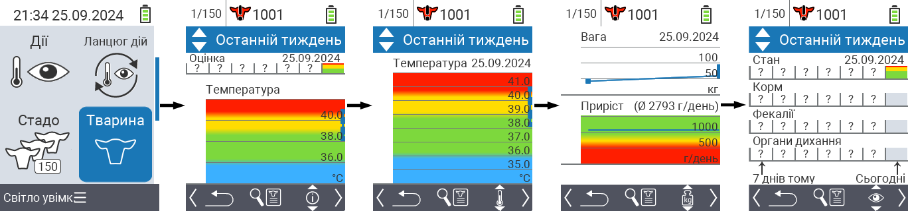
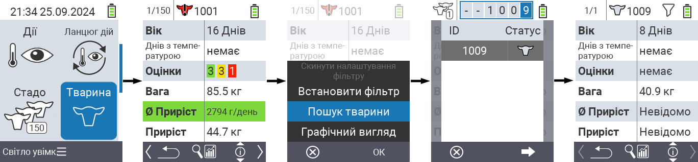
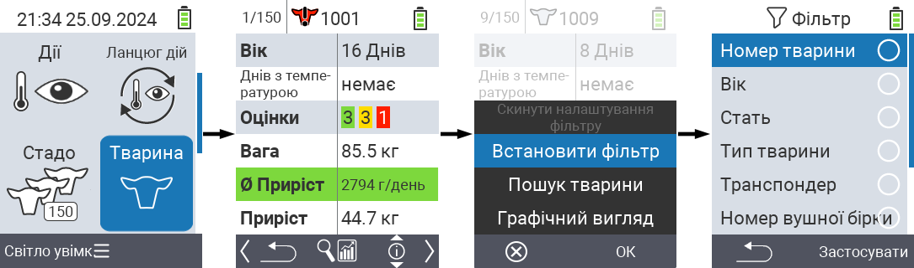

## Тварина {#animal}

Функція окремої тварини дозволяє переглядати важливу інформацію про вагу, температуру та рейтинг для кожної окремої тварини. Ви завжди маєте можливість відображати інформацію у вигляді графіка або списку. Щоб використовувати функцію окремої тварини, виконайте наступні дії:

1. На головному екрані вашого пристрою VitalControl виберіть пункт меню  `` і натисніть кнопку ``.

2. Відкриється огляд найважливішої інформації про тварину. Верхній край екрана показує, яку тварину ви зараз переглядаєте. Використовуйте клавішу `F3`, щоб вибрати між інформацією про тварину , температурою , вагою  та рейтингом .

{}
У кожному відображенні інформації ви маєте можливість [шукати тварину](#search-animal), встановлювати [фільтр](#set-filter) та переключатися на [графічний вигляд](#set-graphical-view).
Ви також можете перемикатися між окремими тваринами в будь-який час за допомогою клавіш зі стрілками ◁ ▷.
{}

### Встановити графічний вигляд {#set-graphical-view}

1. Натисніть середню верхню кнопку `On/Off` , щоб відкрити спливаюче меню. У цьому меню ви можете вибрати між функціями ``, `` або ``.

2. Виберіть `` за допомогою стрілок △ ▽ і підтвердіть натисканням ``.

### Пошук тварини {#search-animal}

1. Натисніть середню верхню кнопку `On/Off`  для відкриття спливаючого меню. У цьому меню ви можете вибрати між функціями ``, `` або ``.

2. Виберіть `` за допомогою стрілок △ ▽ і підтвердіть натисканням ``.

3. Використовуйте стрілки △ ▽ ◁ ▷ для вибору потрібного номера тварини і підтвердіть натисканням ``.

### Встановити фільтр {#set-filter}

1. Натисніть середню верхню кнопку `On/Off`  для відкриття спливаючого меню. У цьому меню ви можете вибрати між функціями ``, `` або ``.

2. Виберіть `` за допомогою стрілок △ ▽ і підтвердіть натисканням ``.
Інструкції щодо використання фільтра можна знайти [тут]().

