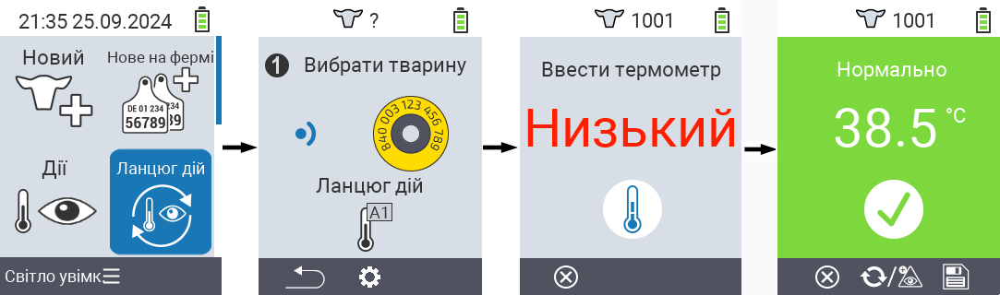
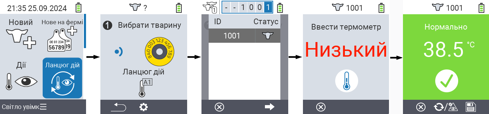
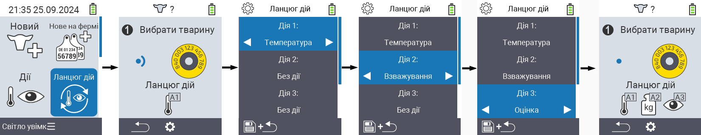

## Ланцюг дій {#chain-of-actions}

Ланцюг дій дозволяє автоматично виконувати кілька дій для тварини одну за одною. Наприклад, ви можете вибрати дії `` та ``. Якщо ви потім виконаєте ланцюг дій, ви можете спочатку виміряти температуру вашої тварини, а потім одразу записати оцінку.

### Використання ланцюга дій {#use-chain-of-actions}

1. На головному екрані вашого пристрою VitalControl виберіть пункт меню &nbsp;&nbsp; `` і натисніть кнопку ``.

2. Або скануйте тварину за допомогою транспондера, або підтвердіть з `` і використовуйте клавіші зі стрілками △ ▽ ◁ ▷ для введення бажаного ідентифікатора тварини.

3. Ланцюг дій тепер виконується. Як тільки всі дії в ланцюзі дій будуть виконані, можна безпосередньо вибрати наступну тварину.



{}

{}
{}

{}


### Налаштування ланцюга дій {#set-chain-of-actions}

1. На головному екрані вашого пристрою VitalControl виберіть пункт меню &nbsp;&nbsp; `` і натисніть кнопку ``.

2. Використовуйте кнопку `F2` &nbsp;&nbsp; (``).

3. З'являється екран накладання. Використовуйте клавіші зі стрілками △ ▽ для вибору між перерахованими діями 1 - 4 (ви можете виконати до чотирьох дій підряд). Використовуйте клавіші зі стрілками ◁ ▷ для вибору бажаної дії для відповідної дії. Збережіть налаштування за допомогою клавіші `F1` &nbsp;&nbsp;.

4. Якщо ви хочете скинути весь ланцюжок дій, виберіть опцію `` у підменю за допомогою клавіш зі стрілками △ ▽ і підтвердіть за допомогою ``.

    

{}
У межах окремих дій у вас є ті самі параметри налаштувань, що й описані в розділі [Дії](../actions) для кожної окремої дії.
{}

{}
Символи на стартовому екрані ланцюжка дій показують, які дії ви встановили і в якому порядку.
{}
