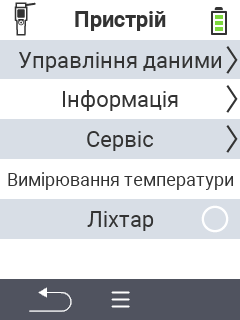

{}
Якщо ви натиснете на пункт меню, ви будете перенаправлені до опису відповідної функції.
{}

<map name="workmap">
  <area shape="rect" coords="2,40,238,80" alt="Управління даними" title="Запуск резервного копіювання даних, експорт ваших даних та скидання пристрою&#10;Клацання мишею: відкрити документацію" href="/uk/docs/device/data-management/">
  <area shape="rect" coords="2,80,238,120" alt="Інформація" title="Перегляд важливої інформації про програмне та апаратне забезпечення&#10;Клацання мишею: відкрити документацію" href="/uk/docs/device/info/">
  <area shape="rect" coords="2,120,238,160" alt="Сервіс" title="Перевірка драйверів пристрою, оновлення прошивки та виконання тесту діапазону&#10;Клацання мишею: відкрити документацію" href="/uk/docs/device/service/">
  <area shape="rect" coords="2,160,238,200" alt="Вимірювання температури" title="Тестування вимірювання температури вашого пристрою&#10;Клацання мишею: відкрити документацію" href="/uk/docs/device/temperature-measurement/">
  <area shape="rect" coords="2,200,238,240" alt="Ліхтарик" title="Увімкнення або вимкнення світла на вашому пристрої VitalControl&#10;Клацання мишею: відкрити документацію" href="/uk/docs/device/flashlight/">

  <area shape="rect" coords="2,282,97,318" alt="Назад" title="Повернутися на один рівень назад" href="/uk/docs/menu/mainmenu/">
</map>
