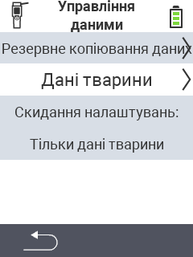

{}
Якщо ви натиснете на пункт меню, ви будете перенаправлені на опис відповідної функції.
{}

<map name="workmap">
  <area shape="rect" coords="2,40,238,80" alt="Резервне копіювання даних" title="Інструкції щодо створення резервної копії можна знайти тут&#10;Клацніть мишею: відкрити документацію" href="/uk/docs/device/data-management/data-backup/">

  <area shape="rect" coords="2,80,238,120" alt="Дані тварин" title="Інструкції щодо відновлення резервної копії можна знайти тут&#10;Клацніть мишею: відкрити документацію" href="/uk/docs/device/data-management/animal-data/">

  <area shape="rect" coords="2,120,238,200" alt="Скидання до заводських налаштувань" title="Всю інформацію та інструкції щодо скидання пристрою та даних тварин можна знайти тут&#10;Клацніть мишею: відкрити документацію" href="/uk/docs/reset/">

  <area shape="rect" coords="2,282,120,319" alt="Назад" title="Всю інформацію та інструкції щодо експорту даних тварин можна знайти тут&#10;Клацніть мишею: відкрити документацію" href="/uk/docs/device/">
</map>
