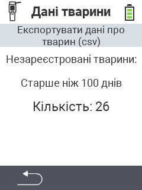

<map name="workmap">
  <area shape="rect" coords="2,40,238,80" alt="Експорт даних про тварин (csv)" title="Експортуйте дані про ваших тварин&#10;Клацніть мишею: відкрити документацію" href="/uk/docs/data-export/usb-drive/">

  <area shape="rect" coords="2,80,238,200" alt="Видалення реєстрації тварин" title="Вкажіть вік, з якого тварини повинні бути видалені з реєстрації&#10;Клацніть мишею: відкрити документацію" href="/uk/docs/device/data-management/animal-data/unregister-animal/">

  <area shape="rect" coords="2,282,120,319" alt="Назад" title="Всю інформацію та інструкції щодо експорту даних про тварин можна знайти тут&#10;Клацніть мишею: відкрити документацію" href="/uk/docs/device/data-management/">
</map>
