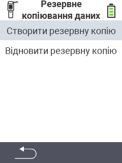

<map name="workmap">
  <area shape="rect" coords="2,40,238,80" alt="Створити резервну копію" title="Інструкції зі створення резервної копії можна знайти тут&#10;Клацніть мишею: відкрити документацію" href="/uk/docs/backup/backup/">

  <area shape="rect" coords="2,80,238,120" alt="Відновити резервну копію" title="Інструкції з відновлення резервної копії можна знайти тут&#10;Клацніть мишею: відкрити документацію" href="/uk/docs/backup/restore/">

  <area shape="rect" coords="2,282,120,319" alt="Назад" title="Повернутися на один рівень назад&#10;Клацніть мишею: відкрити документацію" href="/uk/docs/device/data-management/">
</map>
