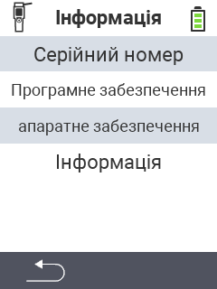

{}
Якщо ви натиснете на пункт меню, ви будете перенаправлені до опису відповідної функції.
{}

<map name="workmap">
  <area shape="rect" coords="2,40,238,80" alt="Серійний номер" title="Щоб отримати серійний номер вашого пристрою, натисніть тут&#10;Клік миші: до документації" href="/uk/docs/device/info/serial-number/">
  <area shape="rect" coords="2,80,238,120" alt="Програмне забезпечення" title="Інструкції щодо перегляду версії вашого програмного забезпечення можна знайти тут&#10;Клік миші: до документації" href="/uk/docs/firmware/versions/">
  <area shape="rect" coords="2,120,238,160" alt="Апаратне забезпечення" title="Щоб отримати доступ до інформації про апаратне забезпечення вашого пристрою, натисніть тут&#10;Клік миші: до документації" href="/uk/docs/device/info/hardware/">
  <area shape="rect" coords="2,160,238,200" alt="Про" title="Виклик інформації про постачальника&#10;Клік миші: до документації" href="/uk/docs/device/info/about/">

  <area shape="rect" coords="2,282,120,319" alt="Назад" title="Повернутися на рівень назад&#10;Клік миші: відкрити документацію" href="/uk/docs/device/">
</map>
