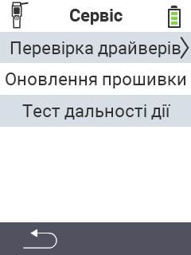

{}
Якщо ви натиснете на пункт меню, ви будете перенаправлені до опису відповідної функції.
{}

<map name="workmap">
  <area shape="rect" coords="2,42,238,82" alt="Перевірка драйверів пристроїв" title="Інструкції з перевірки драйверів пристроїв можна знайти тут&#10;Клацання миші: відкрити документацію" href="/uk/docs/diagnosis/hardware/">
  <area shape="rect" coords="2,82,238,122" alt="Оновлення прошивки" title="Інструкції з оновлення прошивки можна знайти тут&#10;Клацання миші: відкрити документацію" href="/uk/docs/firmware/update/">
  <area shape="rect" coords="2,122,238,162" alt="Тест дальності" title="Інструкції з виконання тесту дальності можна знайти тут&#10;Клацання миші: відкрити документацію" href="/uk/docs/diagnosis/rfid-scan/">

  <area shape="rect" coords="2,282,120,319" alt="Назад" title="Повернутися на рівень назад&#10;Клацання миші: відкрити документацію" href="/uk/docs/device/">
</map>
