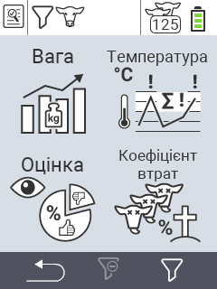

{}
Якщо ви натиснете на пункт меню, ви будете перенаправлені до опису відповідної функції.
{}

<map name="workmap">
  <area shape="rect" coords="3,40,116,160" alt="Вага" title="Оцініть ваші збережені дані в розділі Вага&#10;Клік миші: відкрити документацію" href="/uk/docs/evaluation/weight/">
  <area shape="rect" coords="3,160,116,279" alt="Рейтинг" title="Оцініть ваші збережені дані в розділі Рейтинг&#10;Клік миші: відкрити документацію" href="/uk/docs/evaluation/rating/">

  <area shape="rect" coords="116,40,238,160" alt="Температура" title="Оцініть ваші збережені дані в розділі Температура&#10;Клік миші: відкрити документацію" href="/uk/docs/evaluation/temperature/">
  <area shape="rect" coords="116,160,238,279" alt="Смертність" title="Оцініть ваші збережені дані в розділі Смертність&#10;Клік миші: відкрити документацію" href="/uk/docs/evaluation/mortality/">

  <area shape="rect" coords="150,282,238,319" alt="Фільтр" title="Встановити фільтр&#10;Клік миші: до документації" href="/uk/docs/filter">
  <area shape="rect" coords="2,282,95,319" alt="Назад" title="Повернутися на один рівень назад&#10;Клік миші: до документації" href="/uk/docs/menu/mainmenu/">
</map>
