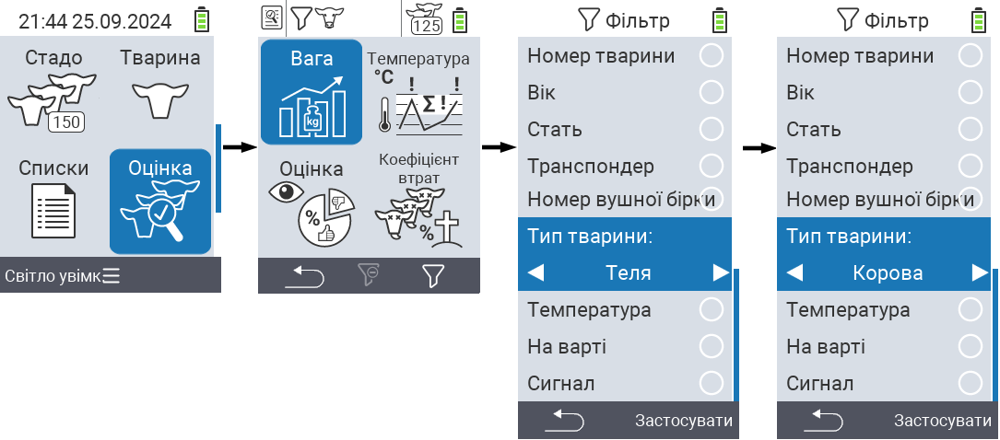
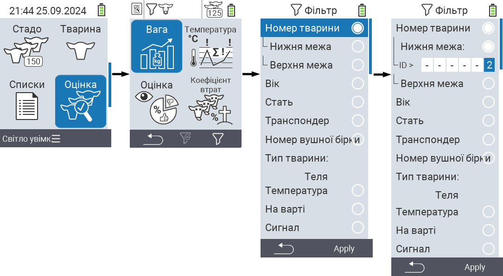
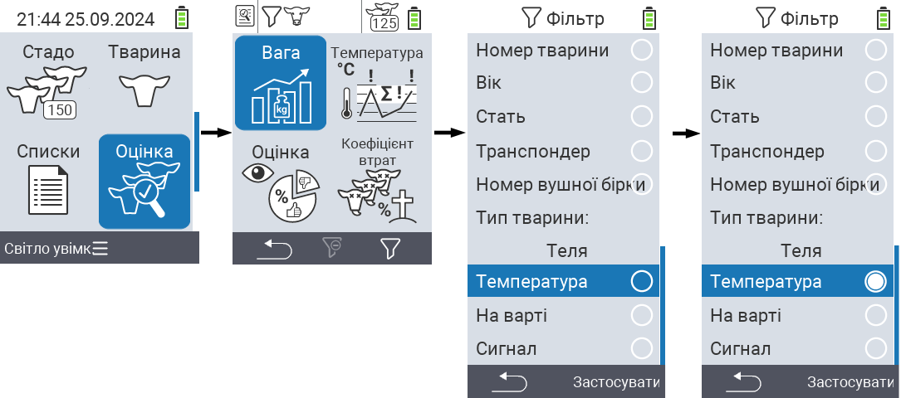

## Застосування фільтрів {#applying-filters}

{}
Фільтр допомагає вам виконати вибір за допомогою критеріїв фільтрації в пунктах меню ``, `` та `` пристрою VitalControl. Як тільки ви застосуєте фільтр, у верхній частині екрана з’являться символи для різних критеріїв фільтрації. Ці символи допомагають вам дізнатися, чи активовані критерії фільтрації та які саме. Наприклад, якщо ви встановите фільтр `` на чоловічу стать, пристрій буде використовувати лише чоловічих тварин. Наприклад, якщо ви також активуєте фільтр ``, пристрій буде використовувати лише чоловічих тварин, які знаходяться у списку спостереження.
{}

Щоб створити фільтр в оцінках, виконайте наступні дії:

1. У підменю, що належить до верхнього пункту меню  ``, натисніть клавішу `F3`  один раз. У підменю, що належить до верхніх пунктів меню  `` та  ``, вам потрібно натиснути клавішу двічі.

2. Відкриється підменю, в якому ви можете встановити всі параметри фільтрації. Ви можете фільтрувати за ``, ``, ``, ``, ``, ``, ``, `` та ``.

3. Для фільтрів ``, ``, `` та `` перейдіть до відповідної області та підтвердіть за допомогою ``. Використовуйте клавіші зі стрілками ◁ ▷, щоб вказати бажане налаштування. Використовуйте клавішу `F3` ``, щоб застосувати вибране налаштування. Щоб скасувати зміни фільтра, натисніть клавішу `F1` &nbsp;&nbsp;.

   

4. Для фільтрів `` та `` виберіть відповідний критерій і підтвердіть, натиснувши ``. Тепер вам буде показано нижню та верхню межу. Перейдіть до бажаної межі за допомогою клавіш зі стрілками △ ▽ і підтвердіть, натиснувши `` двічі. Тепер ви можете встановити бажане число за допомогою клавіш зі стрілками ◁ ▷ та клавіш зі стрілками △ ▽. Після того, як усі налаштування будуть правильними, натисніть `` ще раз, щоб вийти з режиму налаштування та застосувати вибрані фільтри за допомогою клавіші `F3` ``. Використовуючи клавішу `F1` &nbsp;&nbsp;, ви можете скасувати свої зміни, якщо це необхідно.

   

5. Для фільтрів ``, `` та `` є можливість вимкнути або увімкнути їх застосування. Для цього виберіть відповідний фільтр і підтвердіть, натиснувши ``. Фільтр тепер активний. Підтвердіть ще раз, натиснувши ``, щоб деактивувати фільтр.

   

6. Після того, як ви встановили всі фільтри, використовуйте клавішу `F3` ``, щоб застосувати визначені фільтри, або натисніть клавішу `F1` , щоб скасувати свої зміни до фільтрів.
