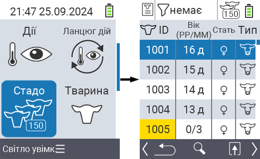
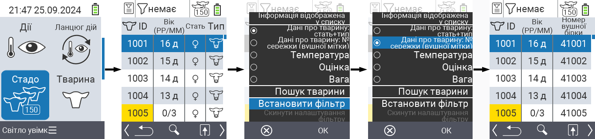
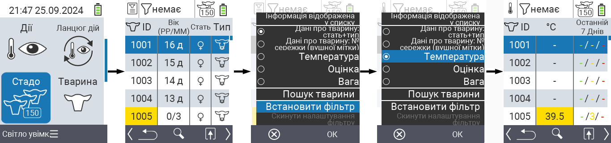
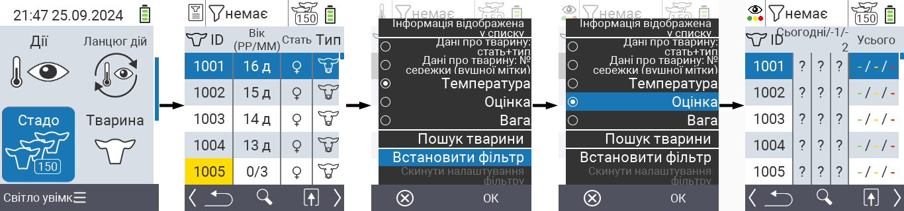
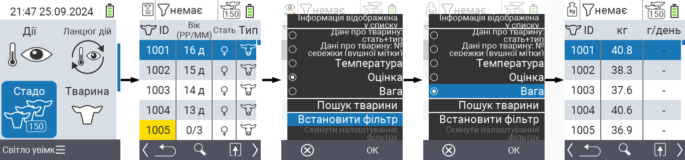
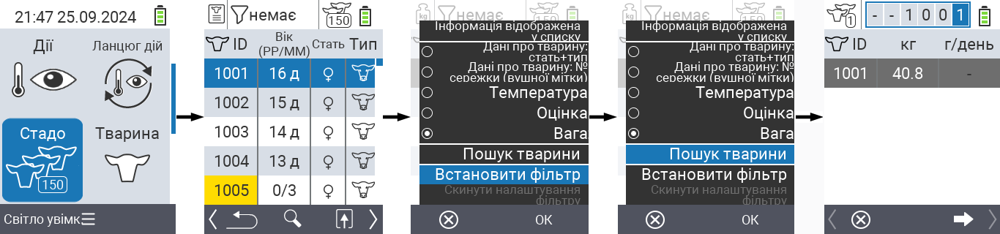
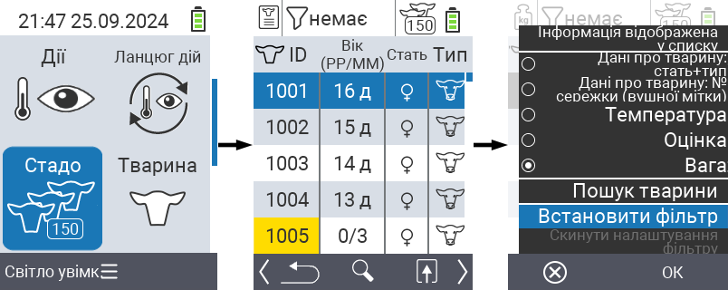
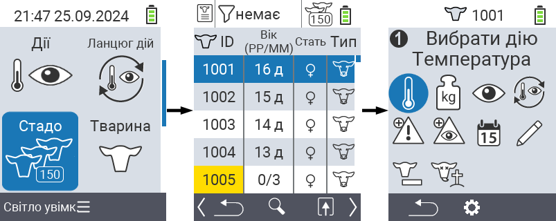

## Стадо {#herd}

У пункті меню "Стадо" ви можете переглянути все своє стадо, шукати окремих тварин та відображати важливу інформацію. Ви маєте наступні можливості:

- Переглянути [дані про тварин](#view-animal-data)
- Переглянути [дані про температуру](#display-temperature)
- Переглянути [дані про рейтинг](#view-rating)
- Переглянути [дані про вагу](#view-rating)
- [Шукати тварину](#search-animal)
- Встановити [фільтр](#set-filter)
- [Дії](#call-action-menu)

### Підготовчі кроки {#preparatory-steps}

1. На головному екрані вашого пристрою VitalControl виберіть пункт меню  `` і натисніть кнопку ``.

2. Відкриється огляд вашого стада.

    

### Переглянути дані про тварин {#view-animal-data}

1. Виконайте підготовчі кроки.

2. Використовуйте клавішу `F3` &nbsp;&nbsp; для виклику спливаючого меню, яке містить категорії інформації, що можуть бути відображені для списку стада. Використовуйте клавіші зі стрілками △ ▽ для виділення рядка `` або `` і виберіть цю категорію, натиснувши центральну кнопку `` або клавішу `F3` ``. Дві опції вибору відрізняються відображенням інформаційної панелі.

3. Дані про тварин тепер будуть відображатися як вміст списку стада.

4. Альтернативно, ви можете використовувати клавіші зі стрілками ◁ ▷ для переключення між різними варіантами відображення.

    

{}
За замовчуванням, спочатку відображаються дані про тварин. Тільки коли ви, наприклад, відображаєте вагу, вам потрібно знову встановити відображення даних про тварин.
{}

### Відображення температури {#display-temperature}

1. Виконайте підготовчі кроки.

2. Використовуйте клавішу `F3` &nbsp;&nbsp; для виклику спливаючого меню, яке містить категорії інформації, що можуть бути відображені для списку стада. Використовуйте клавіші зі стрілками △ ▽, щоб виділити рядок `` і виберіть цю категорію, натиснувши центральну кнопку `` або клавішу `F3` ``.

3. Дані про температуру тепер будуть відображатися як вміст списку стада.

4. Альтернативно, ви можете використовувати клавіші зі стрілками ◁ ▷ для переключення між різними варіантами відображення.

    

### Перегляд рейтингу {#view-rating}

1. Виконайте підготовчі кроки.

2. Використовуйте клавішу `F3` &nbsp;&nbsp; для виклику спливаючого меню, яке містить категорії інформації, що можуть бути відображені для списку стада. Використовуйте клавіші зі стрілками △ ▽, щоб виділити рядок `` і виберіть цю категорію, натиснувши центральну кнопку `` або клавішу `F3` ``.

3. Дані про рейтинг тепер будуть відображатися як вміст списку стада.

4. Альтернативно, ви можете використовувати клавіші зі стрілками ◁ ▷ для переключення між різними варіантами відображення.

    

### Відображення ваги {#display-weight}

1. Виконайте підготовчі кроки.

2. Використовуйте клавішу `F3` &nbsp;&nbsp; для виклику спливаючого меню, яке містить категорії інформації, що можуть бути відображені для списку стада. Використовуйте клавіші зі стрілками △ ▽, щоб виділити рядок `` і виберіть цю категорію, натиснувши центральну кнопку `` або клавішу `F3` ``.

3. Дані про вагу тепер будуть відображатися як вміст списку стада.

4. Альтернативно, ви можете використовувати клавіші зі стрілками ◁ ▷ для переключення між різними варіантами відображення.

    

### Пошук тварини {#search-animal}

1. Виконайте підготовчі кроки.

2. Використовуйте клавішу `F3` &nbsp;&nbsp; для виклику спливаючого меню, яке містить різні опції. Використовуйте клавіші зі стрілками △ ▽ для виділення функції `` і викликайте функцію пошуку, натиснувши центральну клавішу `` або клавішу `F3` ``. Альтернативно, ви можете використовувати кнопку `On/Off`  одразу після першого кроку.

3. Використовуйте клавіші зі стрілками △ ▽ ◁ ▷ для введення бажаного номера тварини і підтвердіть натисканням ``.

    

### Встановити фільтр {#set-filter}

1. Виконайте підготовчі кроки.

2. Використовуйте клавішу `F3` &nbsp;&nbsp; для виклику спливаючого меню, яке містить різні опції. Використовуйте клавіші зі стрілками △ ▽ для виділення функції `` і викликайте функцію фільтрації, натиснувши центральну клавішу `` або клавішу `F3` ``.

3. Як застосувати фільтр можна знайти [тут]().

    

### Виклик меню дій {#call-action-menu}

Ви завжди маєте можливість викликати меню дій для тварини.

1. Виконайте підготовчі кроки.

2. Виберіть тварину зі списку за допомогою клавіш зі стрілками △ ▽ і підтвердіть натисканням ``.

3. Меню дій тепер відкрите. Як його використовувати можна знайти [тут](../actions).

4. Поверніться до списку стада за допомогою клавіші `F3`.

    
