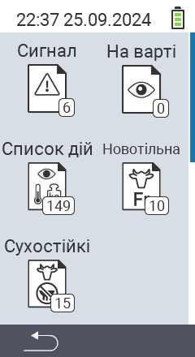

{}
Якщо ви натиснете на пункт меню, ви будете перенаправлені до опису відповідної функції.
{}

<map name="workmap">
  <area shape="rect" coords="3,40,116,160" alt="Список тривог" title="Перевірте свій список тривог&#10;Клацання миші: відкрити документацію" href="/uk/docs/lists/alarm/">
  <area shape="rect" coords="3,160,116,280" alt="Список дій" title="Перевірте свій список дій&#10;Клацання миші: відкрити документацію" href="/uk/docs/lists/actions/">
  <area shape="rect" coords="3,280,116,399" alt="Список сухостійних корів" title="Перевірте свій список сухостійних корів&#10;Клацання миші: відкрити документацію" href="/uk/docs/lists/dry-cows/">

  <area shape="rect" coords="116,40,230,160" alt="Список під наглядом" title="Перевірте свій список під наглядом&#10;Клацання миші: відкрити документацію" href="/uk/docs/lists/on-watch/">
  <area shape="rect" coords="116,160,230,280" alt="Свіжі корови" title="Перевірте свій список свіжих корів&#10;Клацання миші: відкрити документацію" href="/uk/docs/lists/fresh-cows/">

  <area shape="rect" coords="2,401,115,438" alt="Назад" title="Повернутися на один рівень назад" href="/uk/docs/menu/mainmenu/">
</map>
