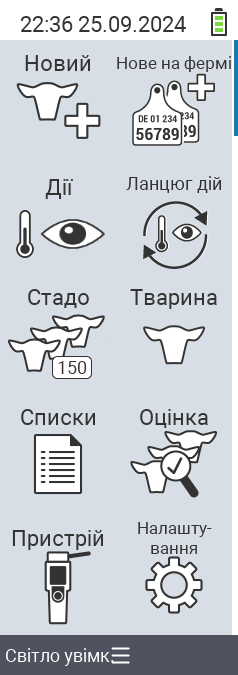

{}
Якщо ви натиснете на пункт меню, ви будете перенаправлені до опису відповідної функції.
{}

<map name="workmap">
  <area shape="rect" coords="3,40,116,160" alt="Новий" title="Створити нових тварин&#10;Клацання миші: відкрити документацію" href="/uk/docs/new/">
  <area shape="rect" coords="3,160,116,280" alt="Дії" title="Дії з тваринами&#10;Клацання миші: відкрити документацію" href="/uk/docs/actions/">
  <area shape="rect" coords="3,280,116,400" alt="Стадо" title="Меню стада&#10;Клацання миші: відкрити документацію" href="/uk/docs/herd/">
  <area shape="rect" coords="3,400,116,520" alt="Списки" title="Списки тварин&#10;Клацання миші: відкрити документацію" href="/uk/docs/lists/">
  <area shape="rect" coords="3,520,116,634" alt="Пристрій" title="Пристрій&#10;Клацання миші: відкрити документацію" href="/uk/docs/device/">

  <area shape="rect" coords="116,40,230,160" alt="Новий на фермі" title="Доступ тварин&#10;Клацання миші: відкрити документацію" href="/uk/docs/new-on-farm/">
  <area shape="rect" coords="116,160,230,280" alt="Ланцюг дій" title="Ланцюг дій&#10;Клацання миші: відкрити документацію" href="/uk/docs/chain-of-actions/">
  <area shape="rect" coords="116,280,230,400" alt="Тварина" title="Тварина&#10;Клацання миші: відкрити документацію" href="/uk/docs/animal/">
  <area shape="rect" coords="116,400,230,520" alt="Оцінка" title="Оцінка&#10;Клацання миші: відкрити документацію" href="/uk/docs/evaluation/">
  <area shape="rect" coords="116,520,230,634" alt="Налаштування" title="Налаштування&#10;Клацання миші: відкрити документацію" href="/uk/docs/settings/">
</map>
