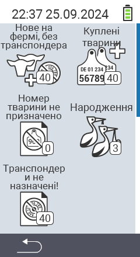

{}
Якщо ви натиснете на пункт меню, ви будете перенаправлені на опис відповідної функції.
{}

<map name="workmap">
  <area shape="rect" coords="3,40,116,160" alt="Нові на фермі, без транспондера" title="Тут ви призначаєте транспондер новим тваринам без транспондера&#10;Клацання миші: відкрити документацію" href="/uk/docs/new-on-farm/new-no-transponder/">
  <area shape="rect" coords="3,160,116,280" alt="Не призначено національний ідентифікатор тварини" title="Тут ви можете переглянути всіх тварин, яким ще не призначено національний ідентифікатор тварини, і призначити його&#10;Клацання миші: відкрити документацію" href="/uk/docs/new-on-farm/no-national-animal-id-assigned/">
  <area shape="rect" coords="3,280,116,399" alt="Не призначено транспондер" title="Тут ви можете переглянути всіх тварин, яким ще не призначено транспондер, і призначити його&#10;Клацання миші: відкрити документацію" href="/uk/docs/new-on-farm/no-transponder-assigned/">

  <area shape="rect" coords="116,40,230,160" alt="Придбані тварини" title="Тут ви можете переглянути свої поточні покупки та експортувати дані&#10;Клацання миші: відкрити документацію" href="/uk/docs/new-on-farm/purchased-animals/">
  <area shape="rect" coords="116,160,230,280" alt="Народження" title="Тут ви можете переглянути свої народження та створити файл експорту&#10;Клацання миші: відкрити документацію" href="/uk/docs/new-on-farm/births/">
  <area shape="rect" coords="1,401,100,439" alt="Назад" title="Повернутися на один рівень назад&#10;Клацання миші: до документації" href="/uk/docs/menu/mainmenu/">
</map>
