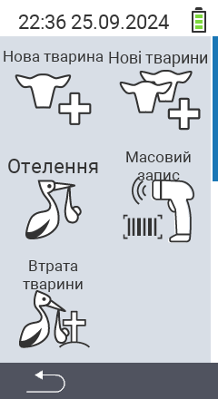

Через головний пункт меню  `` ви потрапляєте до підменю, де представлено 5 підпунктів для вибору:

<map name="workmap">
  <area shape="rect" coords="3,40,116,160" alt="New animal" title="Як зареєструвати нову тварину за допомогою пристрою VitalControl&#10;Клацніть мишею: відкрити документацію" href="/uk/docs/new/animal/">
  <area shape="rect" coords="3,160,116,280" alt="Calving" title="Як зареєструвати новий отелення за допомогою пристрою VitalControl&#10;Клацніть мишею: відкрити документацію" href="/uk/docs/new/calving/">
  <area shape="rect" coords="3,280,116,399" alt="Animal loss" title="Як зареєструвати втрату тварини за допомогою пристрою VitalControl&#10;Клацніть мишею: відкрити документацію" href="/uk/docs/new/animal-loss/">

  <area shape="rect" coords="116,40,230,160" alt="New animals" title="Як створити кілька нових тварин на пристрої VitalControl за одну дію&#10;Клацніть мишею: відкрити документацію" href="/uk/docs/new/animals/">
  <area shape="rect" coords="116,160,230,280" alt="Bulk recording" title="Використовуйте сканер штрих-кодів для запису різних тварин&#10;Клацніть мишею: відкрити документацію" href="/uk/docs/new/bulk-recording/">

  <area shape="rect" coords="1,401,100,439" alt="Back" title="Повернутися на один рівень назад&#10;Клацніть мишею: до документації" href="/uk/docs/menu/mainmenu/">
</map>

{}
Кожне підменю має свою власну іконку. Перемістіть вказівник миші на іконку на графіку вище і залиште його на мить. З'явиться підказка, що показує інформацію для вибраного підменю. Якщо ви клацнете на одну з іконок, ви будете перенаправлені до опису вибраного підпункту меню.
{}

