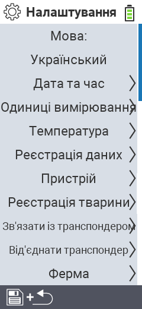

{}
Якщо ви натиснете на пункт меню, ви будете перенаправлені до опису відповідної функції.
{}

<map name="workmap">
  <area shape="rect" coords="2,40,230,120" alt="Мова" title="Встановіть та збережіть мову інтерфейсу користувача на вашому пристрої VitalControl&#10;Клік миші: відкрити документацію" href="/uk/docs/settings/language/">
  <area shape="rect" coords="2,120,230,160" alt="Дата та час" title="Тут ви встановлюєте дату та час&#10;Клік миші: відкрити документацію" href="/uk/docs/settings/datetime/">
  <area shape="rect" coords="2,160,230,200" alt="Одиниці виміру" title="Тут ви вибираєте одиниці виміру для температури та маси&#10;Клік миші: відкрити документацію" href="/uk/docs/settings/units/">
  <area shape="rect" coords="2,200,230,240" alt="Температура" title="Встановіть налаштування температури для застосування вашого пристрою VitalControl&#10;Клік миші: відкрити документацію" href="/uk/docs/settings/temperature/">
   <area shape="rect" coords="2,240,230,280" alt="Збір даних" title="Тут ви зберігаєте відповідну інформацію для збору даних про тварин&#10;Клік миші: відкрити документацію" href="/uk/docs/settings/data-acquisition/">
   <area shape="rect" coords="2,280,230,320" alt="Пристрій" title="Тут ви можете налаштувати різні параметри пристрою&#10;Mausklick: zur Dokumentation" href="/uk/docs/settings/device/">
   <area shape="rect" coords="2,320,230,360" alt="Реєстрація тварин" title="Тут ви можете налаштувати кілька заводських стандартів щодо реєстрації нових тварин відповідно до вимог вашої ферми.&#10;Клік миші: відкрити документацію" href="/uk/docs/settings/animal-registration/">
   <area shape="rect" coords="2,360,230,400" alt="Прив'язка транспондера" title="Встановіть призначення транспондера на вашому пристрої VitalControl&#10;Клік миші: відкрити документацію" href="/uk/docs/settings/transponder-linkage/">
   <area shape="rect" coords="2,400,230,439" alt="Від'єднання транспондера" title="Вкажіть, як буде призначено ідентифікатор тварини після від'єднання транспондера&#10;Клік миші: відкрити документацію" href="/uk/docs/settings/transponder-linkage/">
   <area shape="rect" coords="2,440,230,480" alt="Ферма" title="Постійно збережіть ваш офіційний дванадцятизначний національний ідентифікатор ферми на пристрої VitalControl&#10;Клік миші: відкрити документацію" href="/uk/docs/settings/farm-number/">
   <area shape="rect" coords="2,482,123,519" alt="Назад" title="Повернутися на один рівень назад" href="/uk/docs/menu/mainmenu/">
</map>

