
<a class="btn btn-lg btn-primary me-3 mb-4" href="#td-block-2">
  了解更多 <i class="fas fa-arrow-alt-circle-right ms-2"></i>
</a>
<a class="btn btn-lg btn-secondary me-3 mb-4" href="docs/">
  文件<i class="fa-solid fa-book ms-2 "></i>
</a>

最高水準的健康管理！




{}

**減少** **文書工作**  

**提升** **動物健康**

**一目了然**  

只需**一個裝置**    
{}


{}
 

    

    <button type="button" data-bs-target="#carouselLanguageIndicators" data-bs-slide-to="0" class="active" aria-current="true" aria-label="德語"></button>
    <button type="button" data-bs-target="#carouselLanguageIndicators" data-bs-slide-to="1" aria-label="英語"></button>
    <button type="button" data-bs-target="#carouselLanguageIndicators" data-bs-slide-to="2" aria-label="荷蘭語"></button>
    <button type="button" data-bs-target="#carouselLanguageIndicators" data-bs-slide-to="3" aria-label="芬蘭語"></button>
    <button type="button" data-bs-target="#carouselLanguageIndicators" data-bs-slide-to="4" aria-label="法語"></button>
    <button type="button" data-bs-target="#carouselLanguageIndicators" data-bs-slide-to="5" aria-label="俄語"></button>
    <button type="button" data-bs-target="#carouselLanguageIndicators" data-bs-slide-to="6" aria-label="西班牙語"></button>
    <button type="button" data-bs-target="#carouselLanguageIndicators" data-bs-slide-to="7" aria-label="波斯尼亞語"></button>
    <button type="button" data-bs-target="#carouselLanguageIndicators" data-bs-slide-to="8" aria-label="保加利亞語"></button>
    <button type="button" data-bs-target="#carouselLanguageIndicators" data-bs-slide-to="9" aria-label="中文"></button>
    <button type="button" data-bs-target="#carouselLanguageIndicators" data-bs-slide-to="10" aria-label="捷克語"></button>
    <button type="button" data-bs-target="#carouselLanguageIndicators" data-bs-slide-to="11" aria-label="挪威語"></button>
    <button type="button" data-bs-target="#carouselLanguageIndicators" data-bs-slide-to="12" aria-label="希臘語"></button>
    <button type="button" data-bs-target="#carouselLanguageIndicators" data-bs-slide-to="13" aria-label="土耳其語"></button>
    <button type="button" data-bs-target="#carouselLanguageIndicators" data-bs-slide-to="14" aria-label="烏克蘭語"></button>
    <button type="button" data-bs-target="#carouselLanguageIndicators" data-bs-slide-to="15" aria-label="愛沙尼亞語"></button>
    
 

    

      

        <h3>德語</h3>
      

      
    

    

      

        <h3>荷蘭語</h3>
      

      
    

    

      

        <h3>英語</h3>
      

      
    

    

      

        <h3>芬蘭語</h3>
      

      
    

    

      

        <h3>法語</h3>
      

      
    

    

      

        <h3>俄語</h3>
      

    
    
  
    

      

        <h3>西班牙語</h3>
      

    
    

      

        

          <h3>波斯尼亞語</h3>
        

      
      

      

        

          <h3>保加利亞語</h3>
        

      
      

      

        

          <h3>中文</h3>
        

      
      

      

        

          <h3>捷克語</h3>
        

      
      

      

        

          <h3>挪威語</h3>
        

      
      

      

        

          <h3>希臘語</h3>
        

      
      
      
      

        

          <h3>土耳其語</h3>
        

      
      
 
      

        

          <h3>烏克蘭語</h3>
        

      
      
 
      

        

          <h3>愛沙尼亞語</h3>
        

      
      
 
  

  <button class="carousel-control-prev" type="button" data-bs-target="#carouselLanguagesAutoplaying" data-bs-slide="prev" style="left: 0px; top: 37px; height: 320px;">
    
    上一個
  </button>
  <button class="carousel-control-next" type="button" data-bs-target="#carouselLanguagesAutoplaying" data-bs-slide="next" style="right: 0px; top: 37px; height: 320px;">
    
    下一個
  </button>

{}

{}
 

    

    <button type="button" data-bs-target="#carouselActionsIndicators" data-bs-slide-to="0" class="active" aria-current="true" aria-label="溫度"></button>
    <button type="button" data-bs-target="#carouselActionsIndicators" data-bs-slide-to="1" aria-label="稱重"></button>
    <button type="button" data-bs-target="#carouselActionsIndicators" data-bs-slide-to="2" aria-label="評分"></button>
    <button type="button" data-bs-target="#carouselActionsIndicators" data-bs-slide-to="3" aria-label="動作鏈"></button>
    <button type="button" data-bs-target="#carouselActionsIndicators" data-bs-slide-to="4" aria-label="警報"></button>
    <button type="button" data-bs-target="#carouselActionsIndicators" data-bs-slide-to="5" aria-label="監控中"></button>
    <button type="button" data-bs-target="#carouselActionsIndicators" data-bs-slide-to="6" aria-label="動物歷史"></button>
    <button type="button" data-bs-target="#carouselActionsIndicators" data-bs-slide-to="7" aria-label="編輯"></button>
    <button type="button" data-bs-target="#carouselActionsIndicators" data-bs-slide-to="8" aria-label="取消註冊"></button>
    <button type="button" data-bs-target="#carouselActionsIndicators" data-bs-slide-to="9" aria-label="動物損失"></button>
    <button type="button" data-bs-target="#carouselActionsIndicators" data-bs-slide-to="10" aria-label="連接轉發器"></button>
    <button type="button" data-bs-target="#carouselActionsIndicators" data-bs-slide-to="11" aria-label="取消連接轉發器"></button>
    <button type="button" data-bs-target="#carouselActionsIndicators" data-bs-slide-to="12" aria-label="連接動物 ID"></button>
    <button type="button" data-bs-target="#carouselActionsIndicators" data-bs-slide-to="13" aria-label="連接電子動物 ID"></button>
  

    

      

        <h3>溫度</h3>
      

      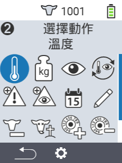
    

    

      

        <h3>稱重</h3>
      

      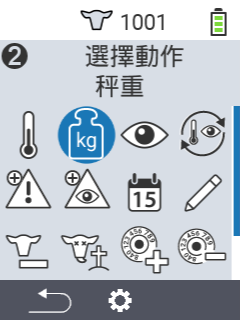
    

    

      

        <h3>評分</h3>
      

      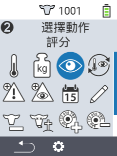
    

    

      

        <h3>動作鏈</h3>
      

      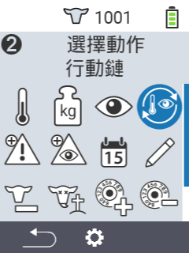
    

    

      

        <h3>警報</h3>
      

      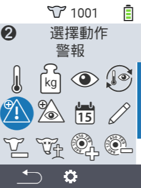
    

    

      

        <h3>監控中</h3>
      

      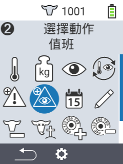
    

    

      

        <h3>動物歷史</h3>
      

      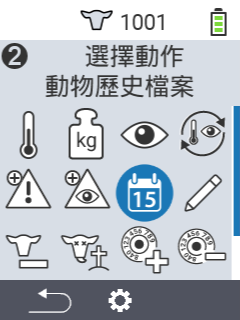
    

    

      

        <h3>編輯</h3>
      

      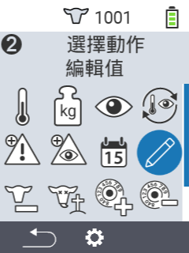
    

    

      

        <h3>取消註冊</h3>
      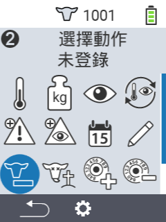
      

    

    

      

        <h3>動物損失</h3>
      

      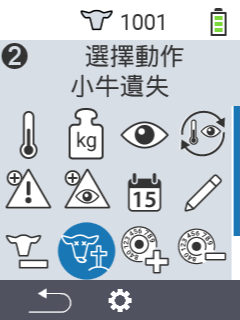
    

    

      

        <h3>連接轉發器</h3>
      

      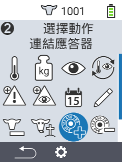
    

    

      

        <h3>取消連接轉發器</h3>
      

      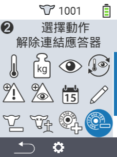
    
      
    

      

        <h3>連接動物 ID</h3>
      

      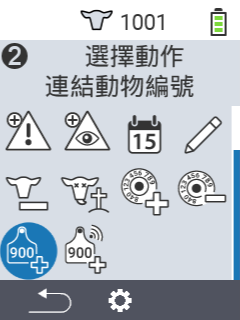
    
   
    

      

        <h3>連接動物 ID</h3>
      

      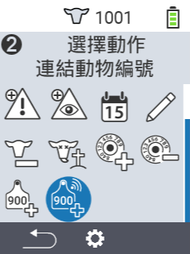
    
             
  

  <button class="carousel-control-prev" type="button" data-bs-target="#carouselActionsAutoplaying" data-bs-slide="prev" style="left: 0px; top: 37px; height: 320px;">
    
    上一個
  </button>
  <button class="carousel-control-next" type="button" data-bs-target="#carouselActionsAutoplaying" data-bs-slide="next" style="right: 0px; top: 37px; height: 320px;">
    
    下一個
  </button>

{}

{}
 

    

    <button type="button" data-bs-target="#carouselListsIndicators" data-bs-slide-to="0" class="active" aria-current="true" aria-label="警報"></button>
    <button type="button" data-bs-target="#carouselListsIndicators" data-bs-slide-to="1" aria-label="監控中"></button>
    <button type="button" data-bs-target="#carouselListsIndicators" data-bs-slide-to="2" aria-label="行動"></button>
    <button type="button" data-bs-target="#carouselListsIndicators" data-bs-slide-to="3" aria-label="新鮮乳牛"></button>
    <button type="button" data-bs-target="#carouselListsIndicators" data-bs-slide-to="4" aria-label="乾乳牛"></button>
  

    

      

        <h3>警報</h3>
      

      
    

    

      

        <h3>監控中</h3>
      

      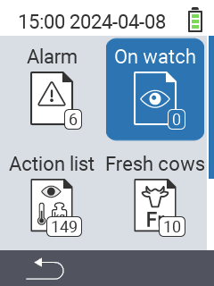
    

    

      

        <h3>行動清單</h3>
      
      
      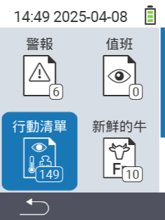
    

    

      

        <h3>新鮮乳牛</h3>
      

      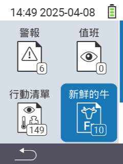
    

    

      

        <h3>乾乳牛</h3>
      

    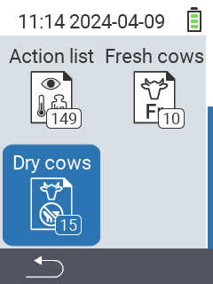
    

  

  <button class="carousel-control-prev" type="button" data-bs-target="#carouselListsAutoplaying" data-bs-slide="prev" style="left: 0px; top: 37px; height: 320px;">
    
    上一個
  </button>
  <button class="carousel-control-next" type="button" data-bs-target="#carouselListsAutoplaying" data-bs-slide="next" style="right: 0px; top: 37px; height: 320px;">
    
    下一個
  </button>

{}

{}
 

    

    <button type="button" data-bs-target="#carouselListsIndicators" data-bs-slide-to="0" class="active" aria-current="true" aria-label="評估體重"></button>
    <button type="button" data-bs-target="#carouselListsIndicators" data-bs-slide-to="1" aria-label="評估溫度"></button>
    <button type="button" data-bs-target="#carouselListsIndicators" data-bs-slide-to="2" aria-label="評估評分"></button>
    <button type="button" data-bs-target="#carouselListsIndicators" data-bs-slide-to="3" aria-label="評估死亡率"></button>
  

    

      

        <h3>體重</h3>
      
 
      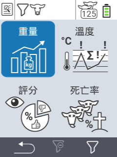
    

    

      

        <h3>溫度</h3>
      
 
      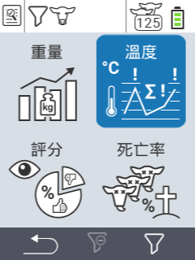
    

    

      

        <h3>評分</h3>
      
 
      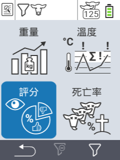
    

    

      

        <h3>死亡率</h3>
      
 
      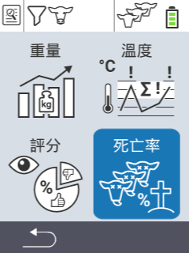
    

  

  <button class="carousel-control-prev" type="button" data-bs-target="#carouselEvaluationAutoplaying" data-bs-slide="prev" style="left: 0px; top: 37px; height: 320px;">
    
    上一個
  </button>
  <button class="carousel-control-next" type="button" data-bs-target="#carouselEvaluationAutoplaying" data-bs-slide="next" style="right: 0px; top: 37px; height: 320px;">
    
    下一個
  </button>

{}  
  

{}  

適合不同**年齡**的多種**動物類型**  

{}  

  
{}  
   
  
   
{}  

{}  
   
  
   
{}  

{}  
   
  
   
{}  

  

{}  

我們為您提供的**亮點**  

{}  

  
{}  
   
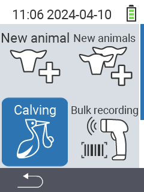  
   
{}  

{}  
   
  
   
{}  

{}  
   
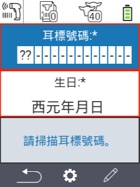  
   
{}  

{}  
   
  
   
{}  

  

{}  
Urban 在社交網絡上  

{}  

{}  

{}  
{}  

{}  
{}  

{}
{}

{}
{}


