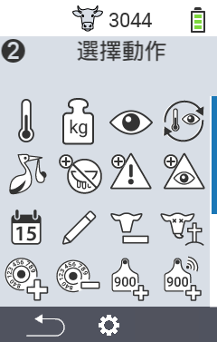
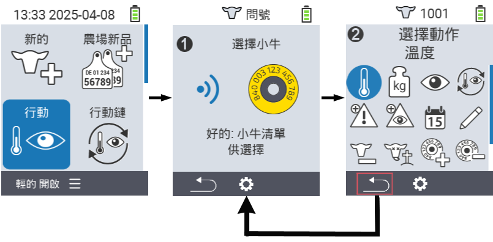
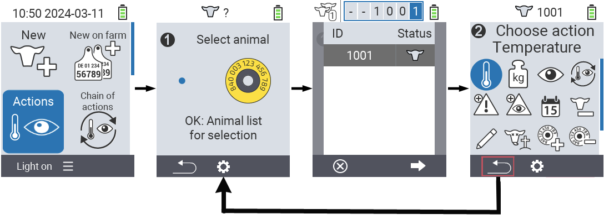

## 可用操作 {#available-actions}

根據動物類型，您可以對動物執行最多 16 種不同的操作。

<map name="workmap">
  <area shape="rect" coords="3,100,60,165" alt="Temperature" title="測量動物的發燒&#10;滑鼠點擊：打開文件" href="/en/docs/actions/measure-temperature/">
  <area shape="rect" coords="60,100,118,165" alt="Weighing" title="記錄動物的重量&#10;滑鼠點擊：打開文件" href="/en/docs/actions/record-weight/">
  <area shape="rect" coords="118,100,174,165" alt="Rating" title="評價您的動物&#10;滑鼠點擊：打開文件" href="/en/docs/actions/rating/">
  <area shape="rect" coords="174,100,230,165" alt="Chain of actions" title="應用和設置操作鏈&#10;滑鼠點擊：打開文件" href="/en/docs/chain-of-actions/">
   <area shape="rect" coords="3,165,60,225" alt="Calving" title="註冊分娩&#10;滑鼠點擊：打開文件" href="/en/docs/actions/calving/">
   <area shape="rect" coords="60,165,120,225" alt="Dry off" title=" 乾奶或將其添加到新鮮奶牛列表&#10;滑鼠點擊：打開文件" href="/en/docs/actions/dry-off/">
   <area shape="rect" coords="120,165,175,225" alt="Alarm" title="將動物添加或移除警報列表&#10;滑鼠點擊：打開文件" href="/en/docs/actions/alarm/">
   <area shape="rect" coords="175,165,230,225" alt="On watch" title="將動物放入觀察列表或移除&#10;滑鼠點擊：打開文件" href="/en/docs/actions/on-watch/">
   <area shape="rect" coords="3,225,60,280" alt="Animal history" title="查看動物的歷史&#10;滑鼠點擊：打開文件" href="/en/docs/actions/animal-history/">
   <area shape="rect" coords="60,225,120,280" alt="Edit" title="編輯所選動物的數據&#10;滑鼠點擊：打開文件" href="/en/docs/actions/edit/">
   <area shape="rect" coords="120,225,175,280" alt="Unregister" title="取消註冊動物&#10;滑鼠點擊：打開文件" href="/en/docs/actions/unregister/">
   <area shape="rect" coords="175,225,230,280" alt="Animal loss" title="註冊動物損失&#10;滑鼠點擊：打開文件" href="/en/docs/actions/animal-loss/">
   <area shape="rect" coords="3,280,60,337" alt="Link transponder" title="為動物分配一個應答器&#10;滑鼠點擊：打開文件" href="/en/docs/actions/link-transponder/">
   <area shape="rect" coords="55,280,120,337" alt="Unlink transponder" title="移除動物的應答器連結&#10;滑鼠點擊：打開文件" href="/en/docs/actions/unlink-transponder/">
   <area shape="rect" coords="120,280,175,337" alt="Link animal ID manually" title="為沒有國家動物 ID 的動物分配一個國家動物 ID&#10;滑鼠點擊：打開文件" href="/en/docs/actions/link-animal-id/#link-animal-id">
   <area shape="rect" coords="175,280,230,337" alt="Link animal ID with scan" title="為沒有國家動物 ID 的動物分配一個國家動物 ID&#10;滑鼠點擊：打開文件" href="/en/docs/actions/link-animal-id/#link-animal-id-with-electronic-ear-tag-scan">

<area shape="rect" coords="100,340,140,375" alt="設定" title="呼叫設定&#10;滑鼠點擊：前往文件" href="/en/docs/actions/setting/">
</map>

{}
每個動作都由一個符號識別。在下方圖形中將滑鼠指標移到一個符號上並稍作停留，會出現一個工具提示，提供關於該動作的信息。如果您點擊其中一個符號，將被轉至該動作的描述。
{}

## 一般程序 {#general-procedure}

在菜單  `` 中，您可以隨時選擇下一個動物，而無需離開動作菜單項。要選擇下一個動物，請按以下步驟操作：

1. 在您的 VitalControl 設備主屏幕上選擇菜單項  `` 並按下 `` 按鈕。

2. 可以使用晶片掃描動物或從列表中選擇動物。按下 `` 確認，並使用箭頭按鈕 △ ▽ 選擇動物。按下 `` 確認。

3. 將打開一個子菜單，其中包含許多動物動作的圖標。使用箭頭按鈕選擇所需的動作，並按下 `` 按鈕開始動作。根據所選動作，將出現一個或多個屏幕或彈出窗口。

4. 如果需要，您現在可以為當前動物選擇並執行另一個動作。

5. 在您為動物執行完所需動作後，返回步驟 2 '動物選擇'。為此，請按頁腳左下角 `` 符號下方的左側按鈕 `F1`。

6. 步驟二的窗口將自動再次打開，您可以選擇下一個動物或按下 `` 符號下方的 `F1` 按鈕返回主菜單。



{}

{}
{}

{}


請提供要翻譯的 Markdown 內容。
