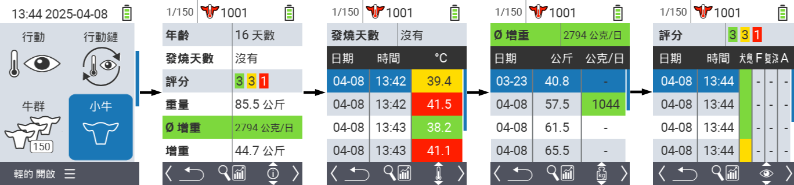
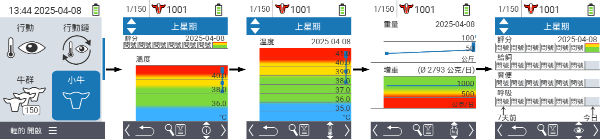
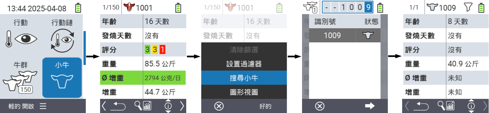
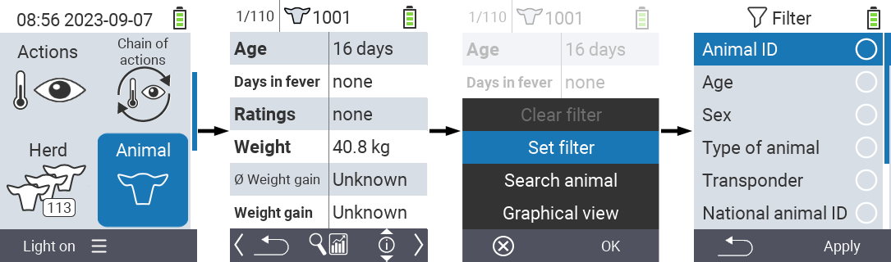

## 動物 {#animal}

個別動物功能允許您查看每個動物的重量、溫度和評級等重要資訊。您始終可以選擇將資訊顯示為圖形或列表。要使用單個動物功能，請按以下步驟操作：

1. 在您的 VitalControl 設備的主畫面上，選擇菜單項目  `` 並按下 `` 按鈕。

2. 最重要的動物資訊概覽將會打開。螢幕的上邊緣顯示您當前正在查看的動物。使用 `F3` 鍵在動物資訊 、溫度 、重量  和評級  之間進行選擇。

{}
在每個資訊顯示中，您可以選擇[搜尋動物](#search-animal)、設置[篩選器](#set-filter)和切換到[圖形視圖](#set-graphical-view)。
您也可以隨時使用箭頭鍵 ◁ ▷ 在個別動物之間切換。
{}

### 設置圖形視圖 {#set-graphical-view}

1. 按下中間上方的 `開/關` 按鈕  以打開彈出選單。在此選單中，您可以選擇 ``、`` 或 `` 功能。

2. 使用方向鍵 △ ▽ 選擇 `` 並按下 `` 確認。

### 搜尋動物 {#search-animal}

1. 按下中間上方的 `On/Off` 按鈕  以開啟彈出選單。在此選單中，您可以選擇 ``、`` 或 `` 功能。

2. 使用方向鍵 △ ▽ 選擇 `` 並按下 `` 確認。

3. 使用方向鍵 △ ▽ ◁ ▷ 選擇所需的動物編號並按下 `` 確認。

### 設定篩選器 {#set-filter}

1. 按下中間上方的 `On/Off` 按鈕  以開啟彈出選單。在此選單中，您可以選擇 ``、`` 或 `` 功能。

2. 使用方向鍵 △ ▽ 選擇 `` 並按下 `` 確認。
您可以在[這裡]()獲得如何使用篩選器的說明。

