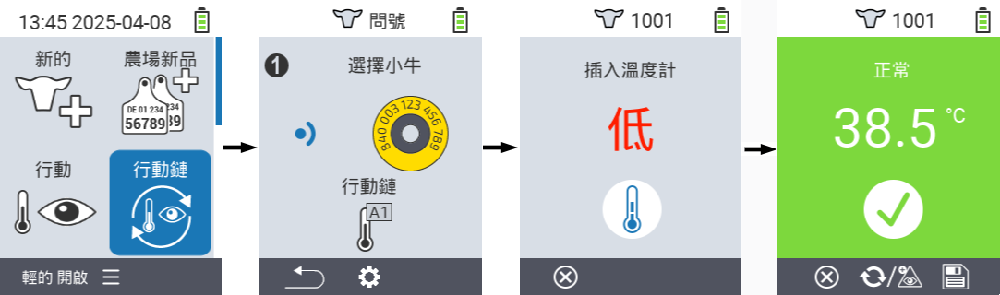
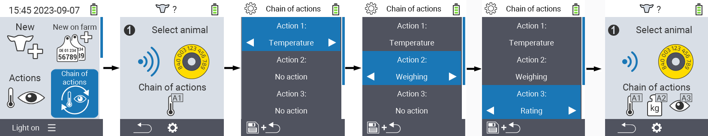

## 動作鏈 {#chain-of-actions}

動作鏈允許您自動為動物連續執行多個動作。例如，您可以選擇動作 `` 和 ``。如果您接著執行動作鏈，您可以先測量動物的體溫，然後立即記錄評分。

### 使用動作鏈 {#use-chain-of-actions}

1. 在您的 VitalControl 設備主畫面上，選擇菜單項 &nbsp;&nbsp; `` 並按下 `` 按鈕。

2. 使用晶片掃描動物或按 `` 並使用方向鍵 △ ▽ ◁ ▷ 輸入所需的動物 ID。

3. 現在動作鏈已經執行。當動作鏈中的所有動作都完成後，可以直接選擇下一個動物。



{}

{}
{}

{}


### 設定動作鏈 {#set-chain-of-actions}

1. 在您的 VitalControl 設備主畫面上，選擇菜單項 &nbsp;&nbsp; `` 並按下 `` 按鈕。

2. 使用按鈕 `F2` &nbsp;&nbsp; (``)。

3. 會彈出一個覆蓋畫面。使用箭頭鍵 △ ▽ 在列出的動作 1 - 4 之間選擇（您可以連續執行最多四個動作）。使用箭頭鍵 ◁ ▷ 為各個動作選擇所需的動作。使用 `F1` 鍵保存設置 &nbsp;&nbsp;。

4. 如果您想重置整個動作鏈，請在子菜單中使用箭頭鍵 △ ▽ 選擇選項 `` 並確認 ``。

   

{}
在各個動作中，您擁有與章節 [Actions](../actions) 中描述的每個單獨動作相同的設置選項。
{}

{}
動作鏈開始畫面中的符號顯示您已設置的動作及其順序。
{}
