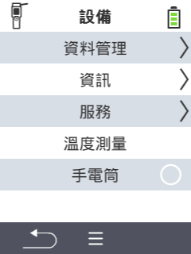

{}
如果您點擊選單項目，您將被重定向到相應功能的描述。
{}

<map name="workmap">
  <area shape="rect" coords="2,40,238,80" alt="資料管理" title="執行資料備份、匯出您的資料並重置裝置&#10;滑鼠點擊：開啟文件" href="/en/docs/device/data-management/">
  <area shape="rect" coords="2,80,238,120" alt="資訊" title="查看重要的軟體和硬體資訊&#10;滑鼠點擊：開啟文件" href="/en/docs/device/info/">
  <area shape="rect" coords="2,120,238,160" alt="服務" title="檢查您的裝置驅動程式，更新您的韌體並執行範圍測試&#10;滑鼠點擊：開啟文件" href="/en/docs/device/service/">
  <area shape="rect" coords="2,160,238,200" alt="溫度測量" title="測試您的裝置的溫度測量&#10;滑鼠點擊：開啟文件" href="/en/docs/device/temperature-measurement/">
  <area shape="rect" coords="2,200,238,240" alt="手電筒" title="開啟或關閉您的 VitalControl 裝置的燈光&#10;滑鼠點擊：開啟文件" href="/en/docs/device/flashlight/">

  <area shape="rect" coords="2,282,97,318" alt="返回" title="返回上一層" href="/en/docs/menu/mainmenu/">
</map>
