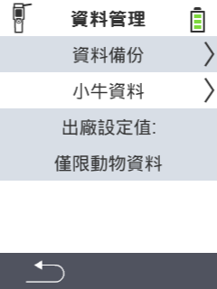

{}
如果您點擊選單項目，將會被重定向到相應功能的描述。
{}

<map name="workmap">
  <area shape="rect" coords="2,40,238,80" alt="資料備份" title="這裡可以找到建立備份的說明&#10;滑鼠點擊：開啟文件" href="/zh/docs/device/data-management/data-backup/">

  <area shape="rect" coords="2,80,238,120" alt="動物資料" title="這裡可以找到還原備份的說明&#10;滑鼠點擊：開啟文件" href="/zh/docs/device/data-management/animal-data/">

  <area shape="rect" coords="2,120,238,200" alt="恢復出廠設定" title="這裡可以找到重置裝置和動物資料的所有資訊和說明&#10;滑鼠點擊：開啟文件" href="/zh/docs/reset/">

  <area shape="rect" coords="2,282,120,319" alt="返回" title="這裡可以找到匯出動物資料的所有資訊和說明&#10;滑鼠點擊：開啟文件" href="/zh/docs/device/">
</map>
