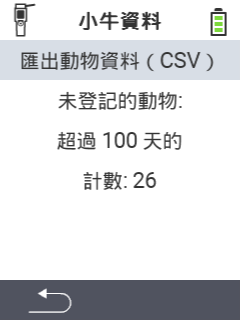

<map name="workmap">
  <area shape="rect" coords="2,40,238,80" alt="匯出動物資料 (csv)" title="匯出您的動物資料&#10;滑鼠點擊：開啟文件" href="/zh/docs/data-export/usb-drive/">

  <area shape="rect" coords="2,80,238,200" alt="取消註冊動物" title="指定應取消註冊動物的年齡&#10;滑鼠點擊：開啟文件" href="/zh/docs/device/data-management/animal-data/unregister-animal/">

  <area shape="rect" coords="2,282,120,319" alt="返回" title="所有有關匯出動物資料的信息和指示都可以在這裡找到&#10;滑鼠點擊：開啟文件" href="/zh/docs/device/data-management/">
</map>
